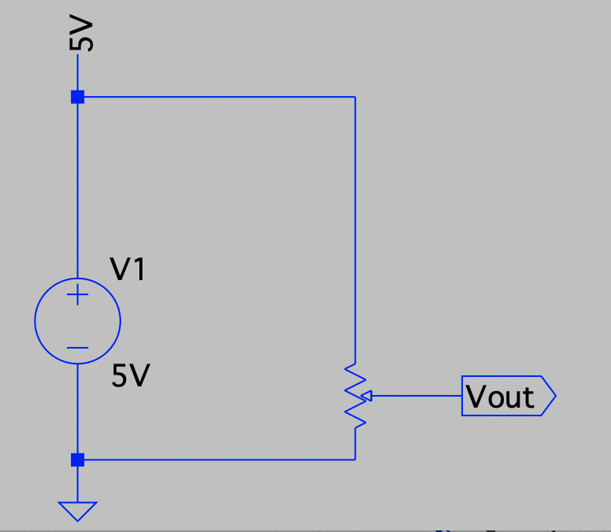
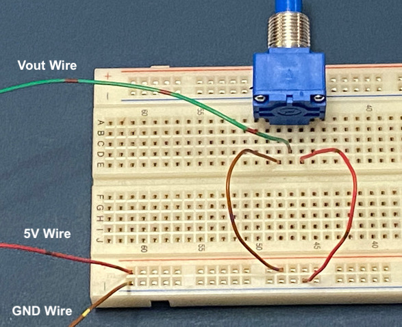
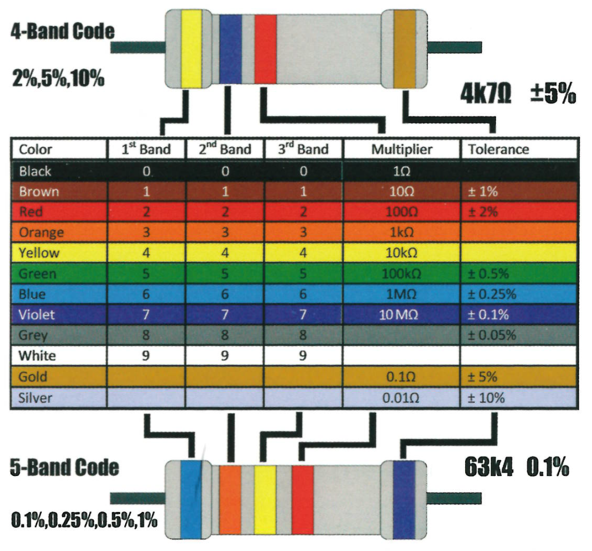

# ECEN 240 Lab 1 -- Analog vs Digital

### NAME :  [insert your name here] 

## Purposes:
-   Become familiar with lab equipment such as digital multimeters and
    power supplies.

-   Learn how to breadboard schematic diagrams.

-   Make comparisons between analog and digital circuits.

## Procedure:

### Part 1. Build an analog voltage output generator with a potentiometer

Build the following and observe the output variation. This circuit will be compared with
the circuit of **Part 2**.

-   Insert a potentiometer in a breadboard
-   Connect the outer pins to 5V and GND
-   Connect the middle pin to an output wire
-   Connect a 5V power supply to the breadboard (use bottom 2 rows)
-   Connect a voltmeter to the output wire and the GND
-   Observe the voltage output variation as you turn the knob.

<b>Analog Voltage Generator Schematic</b>

<b> Breadboarding the analog voltage generator </b>

### Part 2. Build a simple 4-bit Digital to Analog Converter (DAC) and measure the output voltage

* Step 1: Using the resistor color band chart, fill in the following identifying bands for the resistors in the table

| **Resistor** | **Band1** | **Band2** | **Band3** | **Multiplier** | **Tolerance** |
|--------------|-----------|-----------|-----------|----------------|---------------|
| R1 = 4.99K   | Yellow    | White     | White     | Brown          | Brown         |
| R2 = 10K     |           |           |           |                | Brown         |
| R3 = 20K     |           |           |           |                | Brown         |
| R4 = 40.2K   |           |           |           |                | Brown         |
| R5 = 40.2K   |           |           |           |                | Brown         |

 
----

<b> Resistor Color Band Chart </b>

* Step 2: Build the simple 4-bit DAC as shown in the schematic diagram.  You may need to cut and strip wires in order to complete the project.

{width="4.730914260717411in"
height="2.711088145231846in"}

> Schematic of a simple 4-bit DAC
>
> {width="5.113047900262467in"
> height="3.8350371828521435in"}
>

* Step 3: Connect a 5V power supply to the breadboard (use bottom 2
> rows)
>
> Step 4: Connect a voltmeter to the DAC out wire with respect to GND.

> Step 5: Observe the voltage fluctuations as you flip the switches.

>   #### Fill out the DAC Vout table for each possible input code.

>    |**S3**|**S2**|**S1**|**S0**| | **DAC Vout** | **Step Size** |
>    |------|------|------|------|-|--------------|---------------|
>    | 0    | 0    | 0    | 0    | |              |               |
>    | 0    | 0    | 0    | 1    | |              |               |
>    | 0    | 0    | 1    | 0    | |              |               |
>    | 0    | 0    | 1    | 1    | |              |               |
>    | 0    | 1    | 0    | 0    | |              |               |
>    | 0    | 1    | 0    | 1    | |              |               |
>    | 0    | 1    | 1    | 0    | |              |               |
>    | 0    | 1    | 1    | 1    | |              |               |
>    | 1    | 0    | 0    | 0    | |              |               |
>    | 1    | 0    | 0    | 1    | |              |               |
>    | 1    | 0    | 1    | 0    | |              |               |
>    | 1    | 0    | 1    | 1    | |              |               |
>    | 1    | 1    | 0    | 0    | |              |               |
>    | 1    | 1    | 0    | 1    | |              |               |
>    | 1    | 1    | 1    | 0    | |              |               |
>    | 1    | 1    | 1    | 1    | |              |               |
>   #### (40 pts)

## Part 3. Conclusions statement.

> Write a brief conclusions statement that discusses all of the original
> purposes of the lab. Please use complete sentences and correct grammar
> to express your thoughts on how you fulfilled the purposes of the lab:

## Purposes (repeated):
-   Become familiar with lab equipment such as digital multimeters and
    power supplies.
-   Learn how to breadboard schematic diagrams.
-   Make comparisons between analog and digital circuits.

> You might have something to say about the first two bullets, but the
> 3^rd^ bullet deserves the most attention. Specifically, make sure to
> address these questions:

1.  Is the output of a potentiometer truly an analog output?

2.  Is the output of a DAC truly an analog output, or is it more of a
    pseudo analog output? Why or why not?

3.  What is the average voltage step size of the DAC? Can you see how
    this can be calculated?

4.  If you wanted a DAC with a step size 4-times smaller than this DAC,
    what must you do? To answer this question, you need to understand
    that the new DAC would need to produce 64 different levels instead
    of only 16, so how many digital bits would be required?

(The conclusions box will expand as you write)

# Conclusions:
## Conclusion Statement (40 Points)

Congratulations, you have completed Lab!

You may now submit this document.

