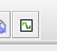

ECEN 240 - Lab 10 -- Counters
=============================

## Name:     [insert your name here]

Purposes:
=========

1.  Become familiar with applications involving flip flops.

2.  Be able to implement synchronous counters.

3.  Use digital simulation software to design and simulate a sequential
    logic circuit.

4.  Learn about, and use, asynchronous control inputs on flip flops.

Procedure:
==========

In this lab you will implement three different globally synchronous
counters:

-   A 3-bit **Up-Counter**

-   A 3-bit **Ring Counter** with a "reset" signal

-   A 2-bit **Gray Code Counter with an "Inc" input**

There will be a 3-part quiz\--one part for each counter. The quiz parts
are intended to be taken before you build the counter so that you can
verify that your design equations are correct.

> **Up-Counter Design**
>
> The counter design will begin with a transition table for the Input
> Forming Logic (IFL). Fill out the required next state values in the
> transition table for a 3-bit globally synchronous **up-counter**
> (remember that globally synchronous means that the clock inputs of all
> the FFs are connected to the same clock signal):

| **Current State** | |   |   | **Next State** ||        |
|:------:|:------:|:-----:|:-:|:------:|:------:|:------:|

| **Q2** | **Q1** | **Q0**|   | **N2** | **N1** | **N0** |
|:------:|:------:|:-----:|:-:|:------:|:------:|:------:|
|   0    |   0    |   0   |   |        |        |        |
|   0    |   0    |   1   |   |        |        |        |
|   0    |   1    |   0   |   |        |        |        |
|   0    |   1    |   1   |   |        |        |        |
|   1    |   0    |   0   |   |        |        |        |
|   1    |   0    |   1   |   |        |        |        |
|   1    |   1    |   0   |   |        |        |        |
|   1    |   1    |   1   |   |        |        |        |

> **Up-Counter Input Forming Logic (IFL) K-Maps**
>
> Fill out the up-counter K-Maps for the next-state variables, N2, N1,
> and N0 and loop the prime implicants (using colors or shading):

### K-Map for N2
|Q1Q0\Q2 | 0 |   | 1 |
|:------:|:-:|:-:|:-:|
|   00   |   |   |   |
|   01   |   |   |   |
|   11   |   |   |   |
|   10   |   |   |   |
|        |   |   |   |

### K-Map for N1
|Q1Q0\Q2 | 0 |   | 1 |
|:------:|:-:|:-:|:-:|
|   00   |   |   |   |
|   01   |   |   |   |
|   11   |   |   |   |
|   10   |   |   |   |
|        |   |   |   |

### K-Map for N0
|Q1Q0\Q2 | 0 |   | 1 |
|:------:|:-:|:-:|:-:|
|   00   |   |   |   |
|   01   |   |   |   |
|   11   |   |   |   |
|   10   |   |   |   |
|        |   |   |   |

# Write the minimized Boolean equations for the next state signals, N2, N1, and N0:

  ------
  N2 =
  ------

  ------
  N1 =
  ------

  ------
  N0 =
  ------

To verify your design is correct:

## \*\*\* Take the First part of Lab 10 Quiz 1 \*\*\*

(This is a 3-part quiz, and the first part is worth 7 points)

## **Build the Up-Counter Input Forming Logic (IFL) Subcircuit**

> Download the "Up\_Counter.circ" template from the module for Lab 10
> and open this file in Logisim Evolution. Open the subcircuit for the
> IFL (left menu) *and implement the IFL design.* The inputs are *Q2*,
> *Q1*, and *Q0*. The outputs are *N2*, *N1*, and *N0*.
>
> Use the *Up\_Counter\_test.txt* test vector file to verify your IFL is
> working correctly.

Paste a snapshot of your IFL test results in the submission box below:

> 
> Test Vector Results for the Up-Counter IFL (5 points)

> Paste a snapshot of your IFL circuit diagram (**including your name**)
> in the submission box below:

> 
> *Logisim Evolution* Circuit Diagram of Up-Counter IFL (5 points)

**Completing the Up-Counter**

The counter will not "count" without the flip flops:

-   Open the "main" circuit and connect the IFL next-state signals (N2,
    N1, and N0) to the flip flops.

-   Wire the rest of the counter.

    -   The "clk" signal should be connected to the flip flops.

    -   The flip flop outputs should be connected to the output ports

    -   The flip flop outputs should also be connected to the input of
        the input forming logic (IFL).

-   Manually test the up-counter (The Logisim clock input is controlled
    with the "Tick once," "Ticks Enabled" and "Tick Frequency" items
    found under the "Simulate" menu).

-   Simulate the counter using the *Logisim* "Chronogram" tool as you
    did in Lab 8. Here are a couple of reminders:

    -   Place an extra clock symbol from the "wiring" menu, and label it
        "sysclk", but don't connect it to anything (sysclk won't appear
        in the final timing diagram).

    -   Open the Chronogram window and select the signals you want to
        display (move them to the right window). You will want both
        clocks and all three output signals.

    -   Click on the clock symbol at the top of the Chronogram for each
        ½ clock cycle you wish to simulate (simulate one complete
        counting sequence):

Paste your Chronogram timing simulation of the completed up-counter in the box below:

> 
>Timing Diagram of the Up-Counter Circuit (5 points)

Paste a snapshot of your complete circuit diagram (**including yourname**) in the submission box below:

> 
>*Logisim Evolution* Complete Circuit Diagram of Up-Counter (5 points)

**Ring Counter Design**

> In this 3-bit synchronous ring counter there will be a reset signal to
> reset the counter to the '001' state using the set and reset inputs on
> the D flip flops (the reset signal will connect to the "set" pin of
> one of the flip flops, and to the "reset" pin of two of the flip flops
> to initialize to "001").
>
> A ring counter has one bit that is "true" or "asserted" at a time.
> Count Sequence: 1 -\> 2 -\> 4 -\> 1 -\> 2 -\> ...
>
> Fill out the expected next state values in the transition table for a
> 3-bit ring counter. Use "don\'t cares" for unused states: xxx

| **Current State** | |   |   | **Next State** ||        |
|:------:|:------:|:-----:|:-:|:------:|:------:|:------:|

| **Q2** | **Q1** | **Q0**|   | **N2** | **N1** | **N0** |
|:------:|:------:|:-----:|:-:|:------:|:------:|:------:|
|   0    |   0    |   0   |   |        |        |        |
|   0    |   0    |   1   |   |        |        |        |
|   0    |   1    |   0   |   |        |        |        |
|   0    |   1    |   1   |   |        |        |        |
|   1    |   0    |   0   |   |        |        |        |
|   1    |   0    |   1   |   |        |        |        |
|   1    |   1    |   0   |   |        |        |        |
|   1    |   1    |   1   |   |        |        |        |

> **Ring Counter IFL K-Maps**
>
> Fill out the ring-counter K-Maps for the next-state variables, N2, N1,
> and N0 and loop the prime implicants (using colors or shading):

### K-Map for N2
|Q1Q0\Q2 | 0 |   | 1 |
|:------:|:-:|:-:|:-:|
|   00   |   |   |   |
|   01   |   |   |   |
|   11   |   |   |   |
|   10   |   |   |   |
|        |   |   |   |

### K-Map for N1
|Q1Q0\Q2 | 0 |   | 1 |
|:------:|:-:|:-:|:-:|
|   00   |   |   |   |
|   01   |   |   |   |
|   11   |   |   |   |
|   10   |   |   |   |
|        |   |   |   |

### K-Map for N0
|Q1Q0\Q2 | 0 |   | 1 |
|:------:|:-:|:-:|:-:|
|   00   |   |   |   |
|   01   |   |   |   |
|   11   |   |   |   |
|   10   |   |   |   |
|        |   |   |   |

### Write the minimized Boolean equations for the next state signals, N2, N1, and N0:

  ------
  N2 =
  ------

  ------
  N1 =
  ------

  ------
  N0 =
  ------

What do you notice about the minimized Boolean equations? Will you need any logic gates to implement this design? Can you anticipate would happen if you do not use a reset signal to set the initial count to "001"? To verify your design is correct:

## \*\*\* Take the Second part of Lab 10 Quiz 1 \*\*\* 

(This is a 3-part quiz, and the second part is worth 7 points)

**Build the Ring-Counter**

> Download the "Ring\_Counter.circ" file template from the Lab 10
> module. Since your design does not require any logic gates for the
> input forming logic, you will not need a subcircuit for the IFL. Your
> entire design can be completed with 3 flip flops (but don't forget the
> reset signal)!
>

To build the complete counter:

-   Connect the flip flops to each other.

-   Connect the clock to the flip flops

-   Connect the "reset" input pin to the appropriate "set" and "reset"
    signals.

-   Connect the flip flop outputs to the Q2, Q1, and Q0 pins

-   Manually test the ring counter as you did with the Up-Counter.

-   Simulate the counter using the *Logisim* "Chronogram" tool as you
    did in the Up-Counter (remember the "sysclk" pin).

You will not need a test vector file to verify that your circuit is functional, but after you have verified that your ring counter is counting correctly, run the Chronogram timing simulation.

Paste your Chronogram timing simulation of the completed ring counter
in the box below:

> 
>Timing Diagram of the Ring Counter Circuit (5 points)

Paste a snapshot of your circuit diagram (**including your name**) in
the submission box below:

> 
>*Logisim Evolution* Circuit Diagram of the Ring Counter (5 points)

## **Gray Code Counter Design**

> Design a 2-bit synchronous counter that has an increment (Inc) input,
> with the count sequence given below, using D flip flops. Use AND, OR
> and NOT gates for the IFL.
>
> Count Sequence: 0 -\> 1 -\> 3 -\> 2 -\> 0 -\> ...
>
> Note: This is a Gray code. It has the advantage of being
> \"glitch-proof\" (it never, even briefly, goes to the wrong state).
>
> Fill out the required next state values in the transition table for
> the Gray Code Counter:

| **Current State** | |   | **Next State** ||        |
|:------:|:------:|:-----:|:------:|:------:|:------:|

| **INC** | **Q1** | **Q0**|   | **N1** | **N0** |
|:-------:|:------:|:-----:|:-:|:------:|:------:|
|    0    |   0    |   0   |   |        |        |
|    0    |   0    |   1   |   |        |        |
|    0    |   1    |   0   |   |        |        |
|    0    |   1    |   1   |   |        |        |
|    1    |   0    |   0   |   |        |        |
|    1    |   0    |   1   |   |        |        |
|    1    |   1    |   0   |   |        |        |
|    1    |   1    |   1   |   |        |        |

> **Gray Code Counter IFL K-Maps**
>
> Fill out the Gray-code counter K-Maps for the next-state variables N1
> and N0 and loop the prime implicants (using colors or shading):

### K-Map for N1
|Q1Q0\Inc | 0 |   | 1 |
|:------:|:-:|:-:|:-:|
|   00   |   |   |   |
|   01   |   |   |   |
|   11   |   |   |   |
|   10   |   |   |   |
|        |   |   |   |

### K-Map for N0
|Q1Q0\Inc | 0 |   | 1 |
|:------:|:-:|:-:|:-:|
|   00   |   |   |   |
|   01   |   |   |   |
|   11   |   |   |   |
|   10   |   |   |   |
|        |   |   |   |

### Write the minimized Boolean equations for the next state signals N1 and N0:
  ------
  N1 =
  ------
  ------
  N0 =
  ------

To verify your design is correct:
## \*\*\* Take the Third part of Lab 10 Quiz 1 \*\*\*
(This third part is worth 6 points)

## **Build the Gray Code Counter Input Forming Logic (IFL) Subcircuit**

-   Download the "Gray\_Counter.circ" file from the Lab 9 module and
    open it in Logisim Evolution.

-   Open the IFL subcircuit. The inputs are *Inc*, *Q1*, and *Q0*. The
    outputs are *N1* and *N0*.

-   Build the IFL subcircuit using AND, OR, NOT or NOR gates.

-   Use the *Gray\_Counter\_test.txt* test vector file to verify your
    IFL is working correctly.

Paste a snapshot of your test results of the Gray Code IFL in the submission box below:

>> 
>Test Vector Results of Gray Code Counter IFL Subcircuit (5 points)

Paste a snapshot of your IFL circuit diagram (**including your name**)
in the submission box below:

> 
>Circuit Diagram of Cray Code Counter IFL Subcircuit (5 points)

**Gray Code Counter Construction**

> The counter will not "count" until flip flops are connected:

-   Place the subcircuit of your IFL in your "main" circuit

-   Add two D flip flops from the "memory" library menu to the right of
    your IFL.

-   Open the "main" circuit and connect the IFL to flip flops.

-   Connect the clock to the flip flops

-   Wire the output ports Q1 and Q0

-   Manually test the up-counter (The Logisim clock input is controlled
    with the "Tick once," "Ticks Enabled" and "Tick Frequency" items
    found under the "Simulate" menu).

-   Simulate the counter using the *Logisim* "Chronogram" tool as you
    did for the previous two counters

Paste your Chronogram timing simulation of the completed Gray Code Counter in the box below (you will need "Inc" to be set to "1" for this simulation to work):

> 
>Timing Diagram of the Gray Code Counter Circuit (5 points)

Paste a snapshot of your complete Gray Code Counter circuit diagram (**including your name**) in the submission box below:

> 
>*Logisim Evolution* Circuit Diagram of 2-bit Gray Counter with Inc (5
points)

# **Part 2**

## **Design the Counters using SystemVerilog**

### **Refer to the SystemVerilog instruction document to implement the Counters on a Basys3 board.**

Paste your SystemVerilog "*Counters" module code in the box* below:

> [Your Code Here]
>Counters Module Code (10 points)

## \*\*\*Pass Off the "Counters" circuit ImplementationUsing Lab10 Quiz 2\*\*\*
(10 points)

# **Conclusions Statement**

Write a brief conclusions statement that discusses the original purposes of the lab found at the beginning of this lab document:

-   What kinds of applications require flip flops?

-   What are the key components of a synchronous counters?

-   How can digital simulation software aid in designing and verifying sequential logic circuits?

-   In what way are asynchronous set and reset signals useful in implementing synchronous, flip flop-based circuits.

Please use complete sentences and correct grammar to express your thoughts:

(The conclusions box will expand as you write)

>
>
>
>

Conclusions Statement (10 points)

Congratulations, you have completed the lab!
You may now submit this document.
