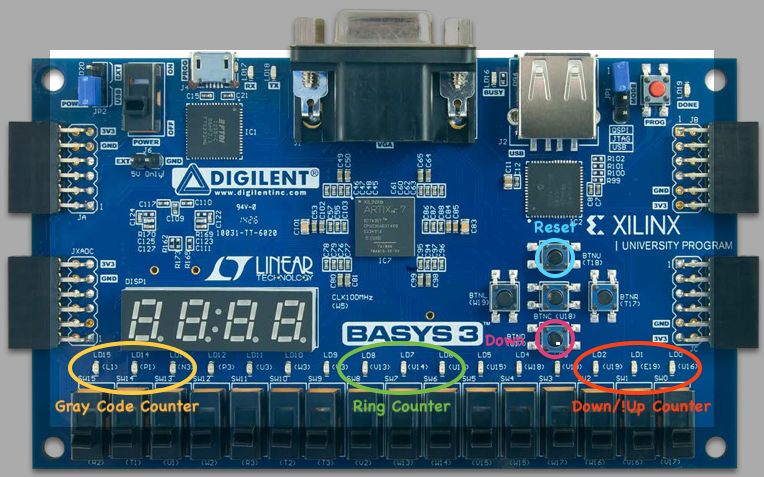
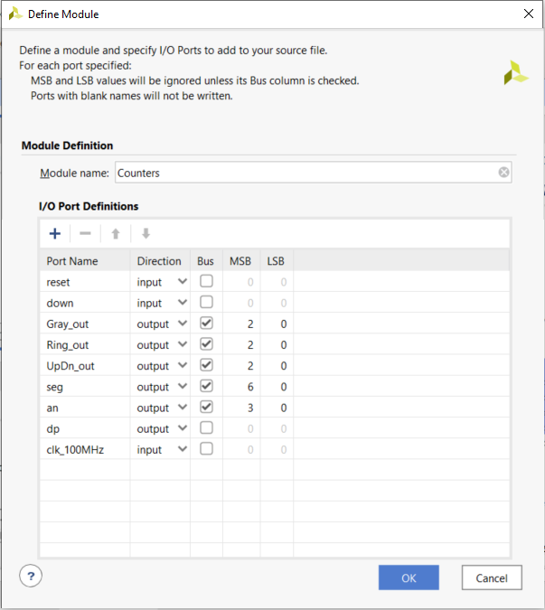
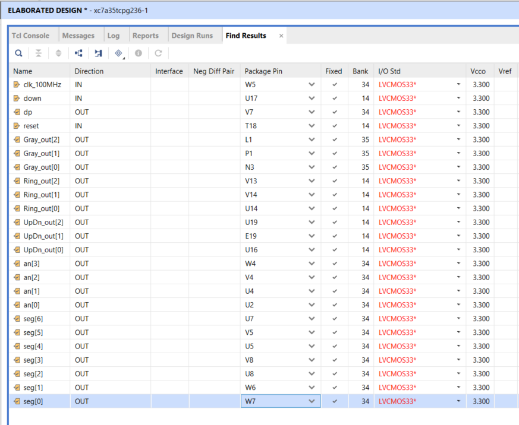

# **ECEN 240 Lab 10 -- Counters**

## **(Vivado and SystemVerilog Instructions)**

Your objective is to build three different counter circuits using the Basys3. The following switches, LEDs, and button assignments will be made:

Procedure:

1\. Download the "clk\_div.v" Verilog module file and the "Counters.xdc" constraints file from Canvas and place them in a convenient place (like your desk top).

2\. Create a Lab10\_Counters project.

3\. You will add two source files to your design:

-   Create a new SystemVerilog module file called "Counters.sv" (make sure to select "SystemVerilog" when you create the file).

-   Add the "clk\_div.v" Verilog module file as a design source.

4\. After you have added the two source files, select "Next" and add the "Counters xdc" as a constraints file. The constraints file will eliminate the need to create the table with the pin number assignments (you can always do this later, or if you choose, you can add or alter the pin connection information manually as in the past).

5\. Configure the project with the correct FPGA filter Settings:

-   Family: Artix-7.

-   Package: cpg236

-   Speed: -1

6\. Select "xc7a35tcpg236-1" and then "Next".

7\. After selecting the "Finish" button you can opt to set up the ports for your "Counters" module. You can include the following port information, (but remember that you can always change this later with the text editor):

8\. Inside of the "Counters" module, instantiate the "clk\_div" module just as you did in the previous lab. You will use the slower clock for your counters. All three of your counters can be in the same module.

9\. Design your counters to do the following:

-   Counter 1 will be a 3-bit up/down counter.

    -   Give it an asynchronous reset to the value of "000".

    -   Have it count "up" by default and "down" when you press the
        "bottom" button.

    -   Design this with the count \<= count +1 style, combining the
        combinational logic with the flip flops

-   Counter 2 will be a 3-bit ring counter.

    -   Give it an asynchronous reset to the value of "001".

    -   Design it to shift left (001 -\> 010 -\> 100 -\> 001 ...).

    -   Design this with the concatenation style {}, separating the input forming logic from the flip flops.

-   Counter 3 will be a 3-bit Gray code counter.

    -   Give it an asynchronous reset to the value of "111".

    -   Design it to count in the repeating sequence "7-5-4-0-1-3-2-6".

10\. Open the "Elaborated" design schematic. Make sure it appears as
you would expect.

11\. Since you added a constraints file, you do not need to tell Vivado
which pins to use on the FPGA chip. You can still click on the blue "24
I/O Ports" at the top of the schematic menu to see if the information is
correct. You should see something like this:

12\. Run the synthesis, implementation and bitstream generation (if you
just perform the bitstream generation, you will be prompted to do the
other steps required).

13\. Connect the Basys3 to the computer using the USB cable, and turn on
the Basys3 power switch.

14\. Select "Open Hardware Manager" from the bottom of the left menu,
and select "Open Target", then "Auto Connect". Once the computer has
connected to the Basys3, you are ready to dump the configuration data
into the FPGA. Select "Program Device".

You are now running the counters on the Basys3! Verify functionality and
pass them off when you are sure they are working correctly.
