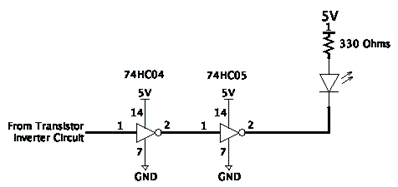
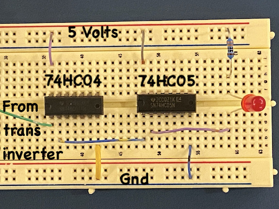
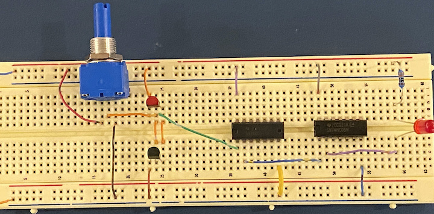

# ECEN 240 Lab 2 -- Logic Inverters

### NAME:  <span style="color:red;">    [insert your name here]
</span>

## Purposes:

-   Learn about the construction and characteristics of a CMOS inverter
-   Measure and record the input and output characteristics of an
    inverter
-   Find the threshold voltage of the inverter
-   Gain experience using the 74HC04 and the 74HC05 inverter chips

## Procedure:

### Part 1 -- Discrete CMOS Inverters

1.)   Construct the inverter shown in the schematic of Figure 1.
Use the left side of the breadboard.

{width="3.4770713035870515in"
height="2.5583803587051617in"}

<p style="text-indent:50px">

<p>
<p style="text-indent:150px">
<b>
Figure 1 - CMOS Inverter
</b>
</p>


<p style="text-indent:150px">

<p>
<p style="text-indent:150px">
<b>
Figure 2 - Pin assignments of the TP2104 (PMOS) and VN2106 (NMOS) Transistors
</b>
</p>


2. Add the potentiometer circuit shown in Figure 3 (also used in Lab 1) and connect its middle pin to the input of the inverter.

<p style="text-indent:150px">

<p>
<p style="text-indent:150px">
<b>
Figure 3 -- Potentiometer circuit used for inverter input voltage
</b>
</p>


<p style="text-indent:150px">

<p>
<p style="text-indent:150px">
<b>
Figure 4 -- Completed Inverter Circuit with a Potentiometer as the Input
</b>
</p>


3. Verify that the inverter circuit is working correctly by adjusting
the knob of the potentiometer while monitoring the input and output
with a voltmeter (if the input is near zero Volts, the output should
be near 5 Volts and vice versa).

4. Make the necessary voltage measurements to complete Table 1. To do
this:

<div style="margin-left: 40px">

* Connect the voltmeter to the input of the inverter and adjust the 
potentiometer knob until it is close to the target "Vin" value on the table.

* Without changing the potentiometer, connect the meter to the output of the inverter and record the "Vout" value.

* Repeat for the next input voltage until done

<br>
<b>
Table 1 -- Inverter Input vs Inverter Output
</b>

| **Vin (Volts)** | **Vout (Volts)** |
|-------------------|-------------------|
|      (Volts)      |      (Volts)      |
|         0         |                   |
|         1         |                   |
|        1.2        |                   |
|        1.4        |                   |
|        1.6        |                   |
|        1.8        |                   |
|         2         |                   |
|        2.1        |                   |
|        2.2        |                   |
|        2.3        |                   |
|        2.4        |                   |
|        2.5        |                   |
|        2.6        |                   |
|        2.7        |                   |
|        2.8        |                   |
|        2.9        |                   |
|         3         |                   |
|        3.2        |                   |
|        3.4        |                   |
|        3.6        |                   |
|        3.8        |                   |
|         4         |                   |
|         5         |                   |

</div>

5. The threshold voltage is defined as the voltage where the input voltage is equal to the output voltage.    From the table data determine the approximate threshold voltage:


    V<sub>threshold</sub> =  ``` [fill_in]```

</span>

<span style="font-weight:bold;color:red;font-size:18px">Take Lab2 Quiz 1</span>
(Link in iLearn Module)

### Part 2. Integrated Circuit Logic inverters.

1.) Keeping the transistor inverter circuit on the left of the breadboard, build the circuit shown in the schematic diagram of **Figure 5** on the right side of the breadboard. Refer to the data sheet of the *74HC04* and *74HC05* to understand the function of each pin on each chip.

>     Notes: These two chips are integrated inverter chips with six (6) inverters integrated into each chip.

-   The *74HC04* inverters are built very much like your discrete
    transistor inverter of **Part 1**.

-   The *74HC05* does not have the top (PMOS) transistor. It can only pull down to GND and cannot pull up to 5V. It can drive more current, however, so it is ideal for driving LEDs.


<p style="text-indent:50px">

<p>
<p style="text-indent:50px">
<b>
Figure 5 -- Two Inverters and an LED
</b>
</p>


<p style="text-indent:30px">

<p>
<p style="text-indent:60px">
<b>
Figure 6 -- Breadboarded Version of Figure 5
</b>
</p>

2. Create a 3 inverter chain by connecting the output of the discrete transistor inverter circuit to the input of the integrated inverter circuit shown in **Figure 5**. The complete circuit is shown in **Figure 7**.
<br> <br>


<p style="text-indent:30px">

<p>
<p style="text-indent:60px">
<b>
Figure 7 -- Complete 3 inverter Circuit
</b>
</p>


3. Find the input threshold voltage of the discrete transistor by observing the voltage at which the LED changes from OFF to ON.  >
    
    V<sub>threshold</sub> =  ``` [FILL_IN] ```

<br>

    Was this voltage similar to the threshold measurement in Part 1?
                    [FILL_IN]


4. With the LED "on", measure the output voltage of each inverter and repeat the measurements with the LED "off".

    |                 |  LED “on” |  LED “off” |
    |-----------------|-----------|------------|
    | Inverter 1 Vout |           |            |
    | Inverter 2 Vout |           |            |
    | Inverter 3 Vout |           |            |


<span style="font-weight:bold;color:red;font-size:18px">Take Lab 2 Quiz 2</span>
(Link in iLearn Module)

### Part 3. Conclusions statement

Write a brief conclusions statement that discusses all of the original purposes of the lab. Please discuss your observations on all four bullets. Please use complete sentences and correct grammar as you express your thoughts (a lengthy report is not necessary):

**Purposes (repeated)** 
1. Learn about the construction and characteristics of a CMOS inverter
2. Measure and record the input and output characteristics of an inverter
3. Find the threshold voltage of the inverter
4. Gain experience using the 74HC04 and the 74HC05 inverter chips

---

```
[ FILL IN YOUR CONCLUSION STATEMENTS HERE ]
```
---
### Congratulations, you have completed Lab!
Save and you may now submit this markdown document on Canvas.
