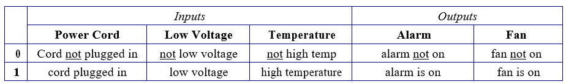
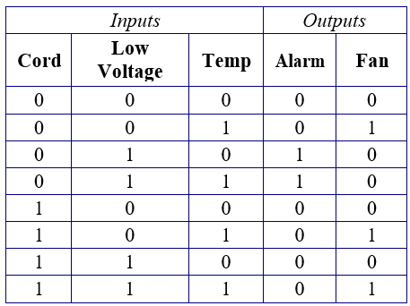

# ECEN 240 Lab 3 -- Logic Gates

### NAME :  <span style="color:red;">[insert your name here] </span>

## Purposes:

-   Review the basic logic gates.
-   Learn how to use a Computer Aided Design (CAD) tool for digital logic simulation.
-   Learn how real-world problems may be solved by solving a simple
    digital design problem.
-   Learn how to implement a digital circuit using the 74xx family of logic gates

## Procedures:

### Part 1
This portion of the lab is intended to be completed after
**Lesson 3 part 2**.

Please do the *"Getting Started with Logisim
Evolution"* tutorial [LINK HERE](./Getting_Started_with_Logisim_Evolution.md).


Review the reading and class slides about the basic logic gates.
Fill out the truth tables that follow with the expected results
for each type of gate, thene using *Logisim Evolution*,
verify the expected results for each of the following gates:

-   Two input NAND gate
-   Two input NOR gate
-   NOT gate
-   Two input AND gate
-   Two input OR gate
-   Two input XOR gate

<span style="font-weight:bold;color:red;font-size:18px">Take Lab 3 Quiz 1</span>


<div style="border: 3px solid red; text-align: center; width:30%;">


**NAND gate**


| **A** | **B** | **Expected <br>Output** | **Logisim <br>Output** |
|-------|-------|---------------------|---------------------|
|   0   |   0   |                     |                     |
|   0   |   1   |                     |                     |
|   1   |   0   |                     |                     |
|   1   |   1   |                     |                     |
|       |       |                     |                     |


</div>


<br>

<div style="border: 3px solid red; text-align: center; width:30%;">

### NOR gate

| **A** | **B** | **Expected <br>Output** | **Logisim <br>Output** |
|-------|-------|---------------------|---------------------|
|   0   |   0   |                     |                     |
|   0   |   1   |                     |                     |
|   1   |   0   |                     |                     |
|   1   |   1   |                     |                     |
|       |       |                     |                     |

</div>

<br>
<div style="border: 3px solid red; text-align: center; width:30%;">

### Not gate (inverter)

| **A** | **B** | **Expected <br>Output** | **Logisim <br>Output** |
|-------|-------|---------------------|---------------------|
|   0   |   0   |                     |                     |
|   0   |   1   |                     |                     |
|   1   |   0   |                     |                     |
|   1   |   1   |                     |                     |
|       |       |                     |                     |

</div>
<br>
<div style="border: 3px solid red; text-align: center; width:30%;">

### AND gate

| **A** | **B** | **Expected <br>Output** | **Logisim <br>Output** |
|-------|-------|---------------------|---------------------|
|   0   |   0   |                     |                     |
|   0   |   1   |                     |                     |
|   1   |   0   |                     |                     |
|   1   |   1   |                     |                     |
|       |       |                     |                     |

</div>

<br>
<div style="border: 3px solid red; text-align: center; width:30%;">

### OR gate

| **A** | **B** | **Expected <br>Output** | **Logisim <br>Output** |
|-------|-------|---------------------|---------------------|
|   0   |   0   |                     |                     |
|   0   |   1   |                     |                     |
|   1   |   0   |                     |                     |
|   1   |   1   |                     |                     |
|       |       |                     |                     |

</div>
<br>
<div style="border: 3px solid red; text-align: center; width:30%;">

### XOR gate

| **A** | **B** | **Expected <br>Output** | **Logisim <br>Output** |
|-------|-------|---------------------|---------------------|
|   0   |   0   |                     |                     |
|   0   |   1   |                     |                     |
|   1   |   0   |                     |                     |
|   1   |   1   |                     |                     |
|       |       |                     |                     |

</div>
<br>

<span style="font-weight:bold;color:red;font-size:18px">Take Lab 3 Quiz 1</span>
(Link in iLearn Module)

**(12 points)**

### Part 2.
<span style=";color:red;">Take Lab 3 Quiz 1
This portion of the lab is to be completed after **Lesson 3 part 2**.
</span>

Problem Statement
>   A laptop microprocessor is to have a circuit built into it which will sound an alarm for low
charge on the battery when the cord is not plugged in, and also control a CPU fan for high
temperature when the battery is not too low. The inputs and outputs for this circuit are
described in the table below.


<div style="text-align: center; width:100%;">



</div>
<br>
<div style="text-align: center; width:50%;">


The exact operation is defined by the following truth table:

  <div style="display: table-cell; vertical-align: middle;">
<span>



</span>
</div>
</div>

Your task is to design the combinational logic circuit that will
operate as described in the truth table above.

Start with the derivation of the equation for the alarm and simplify
as needed. From the truth table, note that the alarm turns on only
when the cord is not plugged in and the voltage is low (the status of
**Temp** does not impact the output). Our equation looks like:

```
Alarm = (low voltage) AND (cord not plugged in)
```

Inserting the actual inputs into the alarm equation gives us

Alarm = (Low Voltage) AND (NOT (Cord))

Though it is possible to simplify the equation for the alarm by
inspection, you are asked to go through the exercise of simplifying
Boolean Equations using theorems. To make the equation easier to read,
assign a single letter to represent each of the signals. Start with
the un-simplified equation for **Alarm**, as shown:

**C** = Cord

**V** = Low Voltage

**T** = Temperature

### Alarm = C'•V•T' + C'•V•T

Use the simplification theorem: **XY + XY' = X**

Substitute **X** with **C'•V**, and **Y** with **T.** The simplified
equation for Alarm is:

---

<div style="border: 3px solid red;font-weight:bold;width:50%;vertical-align:center">
<p> </p>
Alarm =
<p> </p>
</div>

---

Next, write the un-simplified equation for the fan output with respect
to the inputs:
<div style="border: 3px solid red;font-weight:bold;width:50%;align-items:center;">
<p> </p>
(unsimplified) Fan = 
<p> </p>
</div>

---

Simplify the equation using Boolean theorems. Leave the equation in a
sum-of-products form:
<div style="border: 3px solid red;font-weight:bold;width:50%;vertical-align:center;">
<p> </p>
(reduced) Fan =
<p> </p>
</div>

---

> Verify that your simplified equations are correct by filling in the
> outputs based on only on the equations. Then compare with the original
> truth table.


|  **Cord** |  **Low Voltage** |  **Temp** |  **Alarm** |  **Fan**  |
|-----------|------------------|-----------|------------|-----------|
|     0     |         0        |     0     |            |           |
|     0     |         0        |     1     |            |           |
|     0     |         1        |     0     |            |           |
|     0     |         1        |     1     |            |           |
|     1     |         0        |     0     |            |           |
|     1     |         0        |     1     |            |           |
|     1     |         1        |     0     |            |           |
|     1     |         1        |     1     |            |           |

<span style="font-weight:bold;color:red;font-size:18px">Take Lab 3 Quiz 2</span>
(Link in iLearn Module) **(12 points)**

---

### Part 3. Logisim Evolution Circuit.

> In the real-world implementation of this circuit, the digital inputs
> would be coming from sensors and electronic circuits and the outputs
> would control an alarm and fan. In Logisim we use \'input pins\' to
> provide inputs to your digital circuit. The input pins represent a
> sensor, push button or some other type of switch. The Logisim \'output
> pins\' show the output of your digital circuit and represent LEDs, or
> signals going to control some device.
>
> Implement the Boolean equations for the alarm and fan using logic
> gates in *Logisim Evolution* following these steps:

-   Place 3 input pins and two output pins. Use the following pin names:

|  **Input Pin Names** |  **Output Pin Names** |
|----------------------|-----------------------|
|         Cord         |         Alarm         |
|        Voltage       |          Fan          |
|         Temp         |                       |
|

     


-   Place the components (AND gates, OR gates, Inverters), making sure
    that the correct number of pins is configured for each gate.

-   Connect wires. Part of your grade will be on neatness, so try to
    make a circuit diagram that is easy to follow!

-   Add your full name directly below your circuit. To do this, select
    the "***A**"* from the toolbar at the top left, and place the cursor
    below the circuit. Type your name and change the font size if
    necessary so your name is clearly legible.


-   Test your implementation (try all of the possibilities) and make
    sure the circuit works as expected.

### Part 4. 
After you have completed the implementation of your laptop fan
and alarm circuit, you will need to verify its functionality using the
"test vector" tool available in *Logisim Evolution*.

-   Download the test file called "alarm\_and\_fan\_test.txt" found in
    the Lab 3 module in *ILearn*.

-   Place the file in your *Logisim Evolution* folder.

-   Run the "Test Vector" tool from the "Simulate" menu of *Logisim
    Evolution*.

-   Select "Load Vector" and navigate to the "alarm\_and\_fan\_test.txt"
    file.

-   The tool will display a truth table showing the tests that passed
    and the tests that failed. Keep working on your circuit until there
    are no failures.

-   Take a "snapshot" of the window showing your test results, and paste
    the snapshot in the submission box below (the "snipping tool" may be
    used in Windows, or "cmd-shift-4" in Mac OSx).

(The "test vector" border box will expand to fit a screen-shot of your
test results)


Paste the snapshot in the border box below.
>Snapshot of Test Vector Results (10 points)

```bash

                #Screenshot goes here.   Delete these lines and replace with 
                #a link with the following MarkDown URL syntax:

                


```

> 

  


Take a "screenshot" of the circuit (including your name), and paste the
screenshot in the submission box below (the "snipping tool" may be used
in Windows, or "cmd-shift-4" in Mac OSx).

>You can resize the circuit using the up and down arrows found at the bottom-left corner:
>
>
>
 Paste the snapshot in the border box below.


Snapshot of Logisim Evolution Circuit (20 points)

### Part 5. 74xx family of logic gates

The 74xx family of logic gates is a family of integrated circuits
(ICs) that implement all of the basic logic functions. Lab 3 Quiz 3
will link to a set of data sheets that you will use to become familiar
with the function of each pin on the key components.

<span style="color:red;font-size:18px">
To learn about 74xx logic gates,
</span>
<span style="font-weight:bold;color:red;font-size:18px">
take Lab 3: Quiz 3
</span>
(Link in iLearn Module)


**(12 Points)**

### Part 6. Build the laptop fan and alarms circuit
Use 74xx logic gates and demonstrate the functionality to a lab assistant or instructor.

<span style="color:red;font-size:18px">
To pass off your circuit,
</span>
<span style="font-weight:bold;color:red;font-size:18px">
take Lab 3: Quiz 4
</span>
**(20 points)**

### Part 7. Conclusion statement.

Write a brief conclusions statement that discusses all of the original purposes of the lab (repeated below). Please discuss your observations on all four bullets. Please use complete sentences and correct grammar as you express your thoughts (a lengthy report is not necessary):

### **Purposes (repeated):** 
1. Review the basic logic gates.  logic simulation.
2. Learn how real-world problems may be solved by solving a simple digital design problem.
3. Learn how to implement a digital circuit using the 74xx family of logic gates
---

```
[ FILL IN YOUR CONCLUSION STATEMENTS HERE ]
```
---
### Congratulations, you have completed Lab!
Save and you may now submit this markdown document on Canvas.