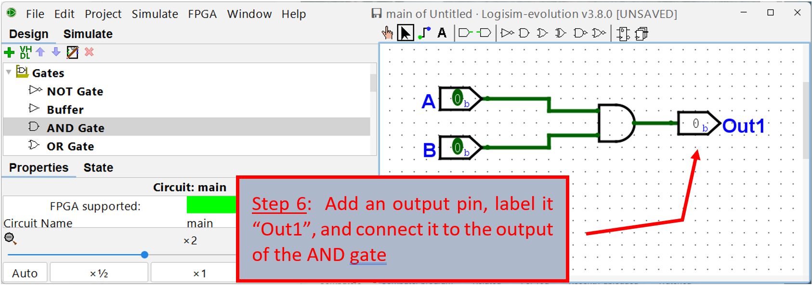
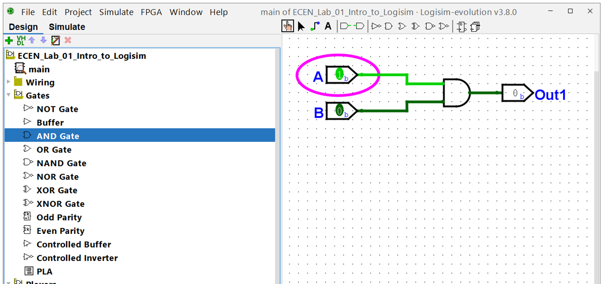

# Getting Started with Logicsim Evolution

## Introduction

***Logisim Evolution*** is a logic circuit simulator written in Java.
The "logisim-evolution.jar" file may be run from any operating system as
long as Java is installed on the system (Windows, Mac OSx, Linux, etc.).
In most systems you simply need to double-click on the "jar" file. In
other systems it is invoked at the command prompt with a command like this:
```bash
java -jar logisim-evolution.jar
```

Logisim-Evolution should be installed on your computer. Installation can
be done by downloading the appropriate installation program. The current
version is ***3.8.0***, and can be found

[LINK HERE](https://github.com/logisim-evolution/logisim-evolution/releases)
<p style="text-indent:30px">

</p>


## Installation 

***Logisim Evolution*** will enable the user to get a firm grasp of
digital logic circuits from a schematic entry and simulation
perspective. Use the following figures as a guide in getting started
with ***Logisim Evolution***.

Screenshots in the rest of the document are from a Windows-based
installation, but MacOS and Linux are almost identical.

After installing and running the program, you should see the initial
Logisim Evolution view:


<p style="text-indent:30px">

</p>

Once you have the ***Logisim Evolution*** window open, follow the steps
below to create a simple circuit:

<p style="text-indent:30px">

</p>

<p style="text-indent:30px">

</p>

<p style="text-indent:30px">

</p>


<p style="text-indent:30px">

</p>

<p style="text-indent:30px">

</p>

<p style="text-indent:30px">

</p>

<p style="text-indent:30px">

</p>

## Simulation of Circuit

With the circuit connected and built, it can be simulated. For now, we
will simulate the operation by manually changing the value of the inputs and seeing the output response. Later in the semester, we'll simulate large circuits with automated stimulus files that both set the inputs,
and check the outputs.


## Finishing

Finally, you can save your design using the Files / Save menu pick.

Before exiting the program, go back to "Design" mode and look around at
the various sub-menus with different types of components that can be
used to make designs. We'll learn about and use many of these during the
course of the class.


<p style="text-indent:30px">

</p>
