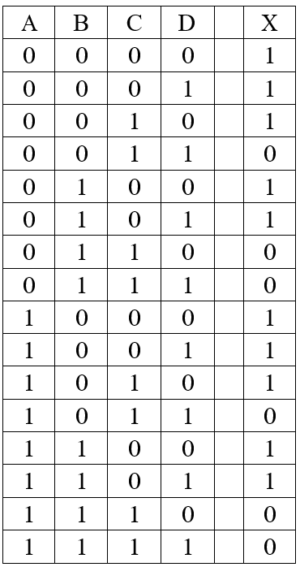
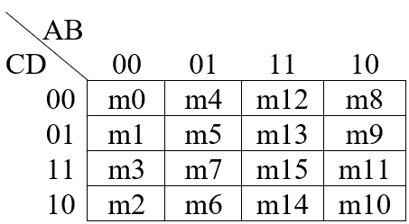

# ECEN 240 Lab 4 -- Small Scale Integrated Circuits (SSI)

### NAME:      [insert your name here]

## Purposes:

1.  Successfully reduce a Boolean logic equation to its simplest form.
2.  Simulate the simplified equation using *Logisim Evolution*.
3.  Learn how to use Small Scale Integrated circuit (SSI) logic devices (7400 family of ICs).
4.  Verify that the circuit correctly implements the truth table of the original equation.
5.  Explore the merits of using only NAND gates to implement a truth table (NOR gates are also functionally complete, but we will use NAND gates).

## Procedure:

There will be two parts to this lab. Both parts of the lab will use the same truth table shown below. With this Truth table, you will:
-   Simplify the Boolean expression two different ways (Using Boolean theorems and K-maps)
-   Implement the simplified equation in Logisim 4 different ways
-   Learn the merits of each type of simplification and implementation

### Part 1

Take Lab 3 Quiz 1!    
This portion of the lab is intended to be completed after **Lesson 4 part 1**.

> Write the non-reduced (10 product) Boolean equation for the previous
> truth table in SOP form:

 

X  =     <!-- FILL IN   -->

 

----

> Simplify the equation using Boolean theorems, and write the reduced
> equation:

 

X  =     <!-- FILL IN   -->

 

----

**K-map-Based Simplification**

> Verify that your fully reduced equation is correct using a Karnaugh
> map:

-   Fill in the K-map from the truth table.
-   Identify the prime implicants.

|    AB&bsol;  CD  | 00 | 01 | 11 | 10 |
|:----------------------------------:|----|----|:--:|----|
| 00                                 |    |    |    |    |
| 01                                 |    |    |    |    |
| 11                                 |    |    |    |    |
| 10                                 |    |    |    |    |

> Make sure you understand how the minterms, m0-m15, are mapped in the
> above K-map.

---

List the minterms that are present in the **largest** prime implicant loop (m0, m1, ...):

 

<!-- FILL IN   -->
  Loop1 = Σm( )

 

---

List the minterms that are present in the **smallest** prime implicant loop:

 

  Loop2 = Σm( ) <!-- FILL IN   -->

 

Verify that the K-map based simplification matches your Boolean theorem-based simplification.

Take Lab 4 Quiz 1
(Link in iLearn Module) **(10 points)**

**Build Version 1 of the Circuit: Use AND, OR and NOT Gates**

> Implement the reduced Boolean equation in *Logisim* using AND, OR, and
> NOT gates. Use the following pin names:

  -----------------------------------------
  Input Names\               Output Names
  (not all will be needed)   
  -------------------------- --------------
  A                          X

  B                          

  C                          

  D                          
  -----------------------------------------

> Make your schematic nice and neat (construction quality will affect
> the score you receive). You can verify its functionality by manually
> testing the input combinations shown in the original truth table.
>
> Once you are convinced your *Logisim* implementation is correct,
> verify its functionality using the "test vector" tool available in
> *Logisim Evolution*.

-   Download the test file called "SSI\_test.txt" found in the Lab 4
    module in *ILearn*.

-   Place the file in your *Logisim Evolution* folder.

-   Run the "Test Vector" tool from the "Simulate" menu of *Logisim
    Evolution*.

-   Select "Load Vector" and navigate to the "SSI\_test.txt" file.

-   The tool will display a truth table showing the tests that passed
    and the tests that failed. Keep working on your circuit until there
    are no failures.

-   Take a "snapshot" of the window showing your test results, and paste
    the snapshot in the submission box below (the "snipping tool" may be
    used in Windows, or "cmd-shift-4" in Mac OSx).

(The "test vector" border box will expand to fit a screen-shot of your
test results)

  --
  --

Test Vector Results with "AND, OR, NOT" Gates (7 points)

> Take a "snapshot" of the circuit (including your name), and paste the
> snapshot in the submission box below (the "snipping tool" may be used
> in Windows, or "cmd-shift-4" in Mac OSx). You can zoom in on the
> circuit using the up and down arrows found at the bottom-left corner.
>
> {width="2.2136745406824145in"
> height="0.8101596675415573in"}
>
> Paste the snapshot in the border box below.

(The circuit box should expand to fit the size of your screen-shot)

  --
  --

*Logisim Evolution* Circuit with "AND, OR, NOT" Gates (8 points)

**Version 2 of the Circuit: NAND Gates Only**

> Re-design the circuit using only NAND gates in *Logisim* and test it
> against the original truth table (use the same pin names).
>
> Once you are convinced your *Logisim* implementation is correct, test
> its functionality using the same test vector file used earlier
> (SSI\_test.txt).
>
> Paste a snapshot of your test results in the submission box below:

  --
  --

Test Vector Results Using **NAND Gates** Only (7 points)

> Paste a snapshot of your circuit diagram (**including your name**) in
> the submission box below:

  --
  --

*Logisim Evolution* Circuit Diagram Using **NAND Gates** Only (8 points)

**\*\*\*Take Lab 4: Quiz 2\*\*\***

**(16-point quiz)**

**Lab 2 Part 2**

Procedure:

1.  Build and debug the simplified SSI circuit using a 74HC08 (2-input
    AND), a 74HC32 (2-input OR), and a 74HC04 (Inverter) integrated
    circuit.

2.  Keeping the previous circuit intact, build and debug the SSI circuit
    using only the 74HC00 (2-input NAND). Compare the operation of the
    NAND only circuit with the 3-chip solution.

**\*\*\*Pass off circuit to TA or Instructor, take Lab 4: Quiz 3
\*\*\***

**(24-point quiz)**

**Conclusions Statement**

> Write a brief conclusions statement that discusses the original
> purposes of the lab found at the beginning of this lab document.

-   What are the methods of Boolean equation simplification, and which
    do you prefer?

-   What can you learn from the several methods you used in this lab to
    implement the same equation?

-   Are there any merits in using only NAND gates to implement a truth
    table?

> Please use complete sentences and correct grammar to express your
> thoughts:

(The conclusions box will expand as you write)

  --
  --

> Conclusions Statement (20 points)
>
> Congratulations, you have completed the lab!
>
> You may now submit this document.
