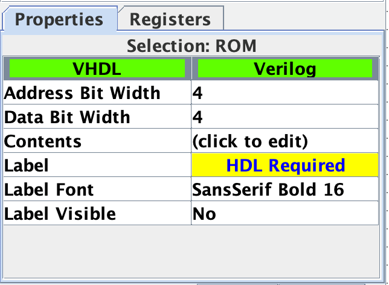
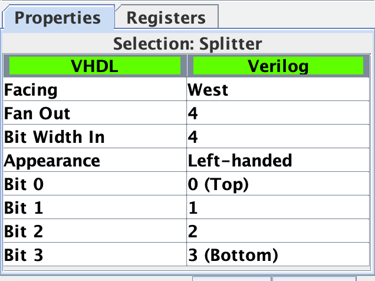
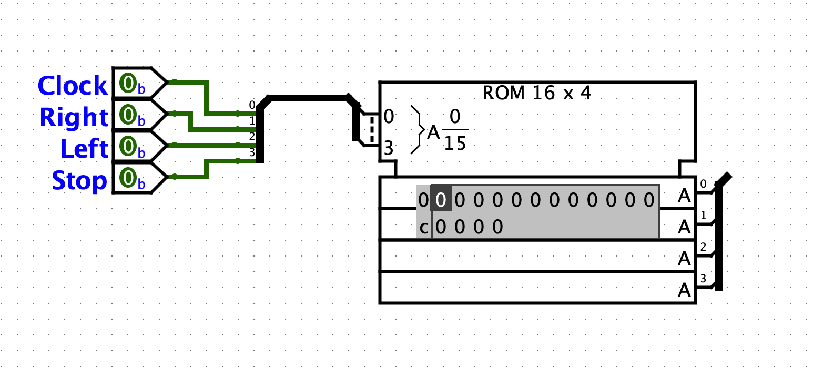

ECEN 240 Lab 5 -- Road Ripper Motor Company
===========================================

Name: 
=====

Purpose:
========

1.  To design and implement a circuit consisting of 4 inputs and 4
    > outputs.

2.  Successfully derive a Boolean equation from a truth table using
    K-Maps.

3.  Implement the simplified equation using a digital simulation program
    using gates.

4.  Implement the truth table using a ROM in Logisim.

5.  Implement the simplified equation using a hardware description
    language and a Field Programmable Gate Array (FPGA).

Project Scenario:
=================

**R2**

\_\_\_/\-\-\-\-\--\\\_\_\_
--------------------------

**\--O\-\-\-\-\-\-\--O\--**

**Road Ripper Motor Company**

> You have accepted a job with the Road Ripper Motor Company. Your first
> task is to upgrade the Road Ripper Motor Company's blinker and brake
> light system to a fully digital system.
>
> Below is a truth table specification of what each light should do when
> the break is depressed (STOP input) and when the turn signal switches
> are activated (LEFT and RIGHT switches). The outputs are the front and
> rear lights on our cars.

| Input (Switches) | |  |   |Outputs (Lights)| |     |       |
|:-----:|:-----:|:-----:|:-:|:-----:|:-----:|:-----:|:-----:|

|  STOP |  LEFT | RIGHT |   |L_FRONT|L_BACK |R_FRONT|R_BACK |
|:-----:|:-----:|:-----:|:-:|:-----:|:-----:|:-----:|:-----:|
|   0   |   0   |   0   |   |   0   |   0   |   0   |   0   |
|   0   |   0   |   1   |   |   0   |   0   | BLINK | BLINK |
|   0   |   1   |   0   |   | BLINK | BLINK |   0   |   0   |
|   0   |   1   |   1   |   | BLINK | BLINK | BLINK | BLINK |
|   1   |   0   |   0   |   |   0   |   1   |   0   |   1   |
|   1   |   0   |   1   |   |   0   |   1   | BLINK | BLINK |
|   1   |   1   |   0   |   | BLINK | BLINK |   0   |   1   |
|   1   |   1   |   1   |   | BLINK |   1   | BLINK |   1   |

> 0 = OFF 1 = ON BLINK = Blinking (Clocked)
>
> In the above truth table "Blink" describes the action of the car's
> turn signals, but "BLINK" is not a valid logic level. To generate a
> signal that can turn on and off like a blinker, we can add a clock to
> inputs. A clock is a signal that alternates between a "1" and "0" in a
> periodic (repetitive) fashion. The CLOCK signal is incorporated into
> the modified truth table below:

| Input (Switches) | |  | | &nbsp;&nbsp;&nbsp;&nbsp;&nbsp;&nbsp;&nbsp;&nbsp;&nbsp;&nbsp;&nbsp;&nbsp;  |Outputs (Lights)| |     |       |
|:-----:|:-----:|:-----:|:-----:|:-:|:-----:|:-----:|:-----:|:-----:|

|  STOP |  LEFT | RIGHT | CLOCK |   |L_FRONT|L_BACK |R_FRONT|R_BACK |
|:-----:|:-----:|:-----:|:-----:|:-:|:-----:|:-----:|:-----:|:-----:|
|   0   |   0   |   0   |   0   |   | 0     | 0     | 0     | 0     |
|   0   |   0   |   0   |   1   |   | 0     | 0     | 0     | 0     |
|   0   |   0   |   1   |   0   |   | 0     | 0     | 0     | 0     |
|   0   |   0   |   1   |   1   |   | 0     | 0     | 1     | 1     |
|   0   |   1   |   0   |   0   |   | 0     | 0     | 0     | 0     |
|   0   |   1   |   0   |   1   |   | 1     | 1     | 0     | 0     |
|   0   |   1   |   1   |   0   |   | 0     | 0     | 0     | 0     |
|   0   |   1   |   1   |   1   |   | 1     | 1     | 1     | 1     |
|   1   |   0   |   0   |   0   |   | 0     | 1     | 0     | 1     |
|   1   |   0   |   0   |   1   |   | 0     | 1     | 0     | 1     |
|   1   |   0   |   1   |   0   |   | 0     | 1     | 0     | 0     |
|   1   |   0   |   1   |   1   |   | 0     | 1     | 1     | 1     |
|   1   |   1   |   0   |   0   |   | 0     | 0     | 0     | 1     |
|   1   |   1   |   0   |   1   |   | 1     | 1     | 0     | 1     |
|   1   |   1   |   1   |   0   |   | 0     | 1     | 0     | 1     |
|   1   |   1   |   1   |   1   |   | 1     | 1     | 1     | 1     |

**Lab 5 Part 1**

Determine the Boolean equations for the brake lights and turn signals
using K-Maps. Use the letters S, L, R, and C (Stop, Left, Right, and
Clock) for the inputs in the Boolean expressions.

K-Maps -- Complete K-map for each signal (make loops by changing text
colors, shading with colors, or by using patterns).

Fill out the Karnaugh map for the **left front** light:

  |RC\SL |  00  |  01  |  11  |  10  |
  |:----:|:----:|:----:|:----:|:----:|
  |  00  |      |      |      |      |
  |  01  |      |      |      |      |
  |  11  |      |      |      |      |
  |  10  |      |      |      |      |
  |

Fill out the Karnaugh map for the **left back** light:

  |RC\SL |  00  |  01  |  11  |  10  |
  |:----:|:----:|:----:|:----:|:----:|
  |  00  |      |      |      |      |
  |  01  |      |      |      |      |
  |  11  |      |      |      |      |
  |  10  |      |      |      |      |
  |

Fill out the Karnaugh map for the **right front** light:

  |RC\SL |  00  |  01  |  11  |  10  |
  |:----:|:----:|:----:|:----:|:----:|
  |  00  |      |      |      |      |
  |  01  |      |      |      |      |
  |  11  |      |      |      |      |
  |  10  |      |      |      |      |
  |

Fill out the Karnaugh map for the **right back** light:

  |RC\SL |  00  |  01  |  11  |  10  |
  |:----:|:----:|:----:|:----:|:----:|
  |  00  |      |      |      |      |
  |  01  |      |      |      |      |
  |  11  |      |      |      |      |
  |  10  |      |      |      |      |
  |

**\
**

> **Refresher on Minterm Mapping**

  |RC\SL |  00  |  01  |  11  |  10  |
  |:----:|:----:|:----:|:----:|:----:|
  |  00  |  m0  |  m4  | m12  |  m8  |
  |  01  |  m1  |  m5  | m13  |  m9  |
  |  11  |  m3  |  m7  | m15  | m11  |
  |  10  |  m2  |  m6  | m14  | m10  |
  |

> Make sure you understand how the minterms, m0-m15, are mapped to the
> above K-maps.\
> List the minterms that are present in the prime implicant loops (m0,
> m1, ...):

  ------------------------
  **left front** = Σm( )
  ------------------------

  -----------------------------------------------
  **left back** (loop that includes m5) = Σm( )
  -----------------------------------------------

  -----------------------------------------------
  **left back** (loop that includes m8) = Σm( )
  -----------------------------------------------

  ------------------------------------------------
  **left back** (loop that includes m14) = Σm( )
  ------------------------------------------------

  -------------------------
  **right front** = Σm( )
  -------------------------

  ------------------------------------------------
  **right back** (loop that includes m3) = Σm( )
  ------------------------------------------------

  ------------------------------------------------
  **right back** (loop that includes m8) = Σm( )
  ------------------------------------------------

  -------------------------------------------------
  **right back** (loop that includes m14) = Σm( )
  -------------------------------------------------

**Boolean Reduction**

> What is the reduced Boolean equation for the left front light?

  ------------
  L\_Front =
  ------------

> What is the reduced Boolean equation for the left back light?

  -----------
  L\_Back =
  -----------

> What is the reduced Boolean equation for the right front light?

  ------------
  R\_Front =
  ------------

> What is the reduced Boolean equation for the right back light?

  -----------
  R\_Back =
  -----------

\*\*\*To Verify Your Design, Take Lab 5 Quiz 1\*\*\*

(Quiz is worth 15 points)

  

# **Lab 5 Part 2**

(You should have taken Lab 5 Quiz 1 before implementing in Logisim)

**Version 1 of the Road-Ripper Circuit: Use AND, OR and NOT Gates**

> Implement the reduced Boolean equation in *Logisim* using AND, OR, and
> NOT gates. Use the following pin names:

| Input Names | Output Names |
|:-----------:|:------------:|
|   Stop      |   L\_Front   |
|   Left      |   L\_Back    |
|   Right     |   R\_Front   |
|   Clock     |   R\_Back    |

> You will find that you can simplify the Logisim circuit by noticing
> that one of the product terms in the L\_Back signal is generated by
> the L\_Front signal. Also, one of the product terms in the R\_back
> signal is generated by the R\_Front signal.
>
> Make your schematic nice and neat (construction quality will affect
> the score you receive).
>
> Place your name under your circuit (make it large enough to read)
>
> You should verify the circuit functionality by manually testing the
> input combinations shown in the original truth table.
>
> Once you are convinced your *Logisim* implementation is correct,
> demonstrate its functionality using the "test vector" tool available
> in the *Simulate* menu of *Logisim Evolution*.

-   Download the test file called "Road\_Ripper\_test.txt" found in the
    Lab3 module in *I-I-Learn*.

-   Place the file in your *Logisim Evolution* folder.

-   Run the "Test Vector" tool from the "Simulate" menu of *Logisim
    Evolution*.

-   Select "Load Vector" and navigate to the "Road\_Ripper\_test" file.

-   The tool will display a truth table showing the tests that passed
    and the tests that failed. Keep working on your circuit until there
    are no failures.

-   Take a "snapshot" of the window showing your test results, and paste
    the snapshot in the submission box below:

(The "test vector" border box will expand to fit a screen-shot of your test results)
------------------------------------------------------------------------------------

> 
> 
>Road Ripper Test Vector Results with "AND, OR, NOT" Gates (10 points)

 
 

Take a "snapshot" of the circuit (including your name), and paste the snapshot in the submission box below:
-----------------------------------------------------------------------------------------------------------

> 
> 
>Logisim Evolution Circuit with "AND, OR, NOT" Gates (10 points)
---------------------------------------------------------------

**Version 2 of the Road-Ripper Circuit: Use a ROM to build the circuit**

> Implement the reduced Boolean equation in *Logisim* using a ROM (Use a
> single ROM and no other gates). A ROM (Read Only Memory) acts very
> much like a truth table, so the entire truth table may be entered into
> the ROM.
>
> The *Logisim* ROM is found in the \"Memory\" folder. The address bit
> width should be set to 4 bits (each address bit serving as one of four
> input signals). The data bit width will also be set to 4 bits (each
> data bit serving as one of the four output signals):
>
> 
>
> A ROM with 4 address bits has 2^4^ memory locations, and each memory
> location in this ROM is set to store 4 bits. The *Logisim* *Evolution*
> symbol for the ROM looks like this:
>
> 
>
> Notice that the ROM Address input is at the upper left of the symbol,
> and it appears that all 4 address bits are merged into a single wire
> "bundle". This is called a "bus" and makes schematic diagrams easier
> to read. The "Data" output is at the bottom right of the symbol, and
> all four outputs are merged into a single bus, as well. To access each
> wire in a bus, you will need to use a "splitter" from the wiring menu
> of *Logisim*.
>
> Place a splitter in your circuit, and set the options to:
>
> 
>
> Move the splitter into position as shown:
>
> 
>
> The "0" on the splitter represents the Least Significant Bit (LSB) and
> the "3" on the splitter represents the Most Significant Bit (MSB). The
> LSB corresponds to the "Clock" signal (C), and the MSB corresponds to
> the "Stop" signal (S).
>
> Connect the respective signals as shown:
>
> 
>
> To connect the outputs, your will need the splitter to be oriented
> "West" instead of "East".
>
> Remember to connect the output signals to the proper splitter pin, and
> add your name below the ROM circuit.
>
> By default, there is no data stored in memory. There are a couple of
> ways to program Logisim ROMs. One way is to use the poke tool (the
> hand with the index finger extended). Select the poke tool, select the
> ROM, then select the cell you want to edit and type a hexadecimal
> value. The other way to edit the contents of the ROM is to select the
> ROM with the edit tool and then in the "Selection: ROM" window, click
> the "(click to edit)" item in the "Contents" row of the window. This
> pops up a "Logisim: Hex Editor" window. Select the cell you want to
> edit in the Hex Editor and enter a hexadecimal value. You can save the
> contents of the hex editor to a file and open files from which you can
> read into the hex editor.
>
> The value in using a ROM to implement your truth table is that there
> is no need for simplification. Simply enter the output data from the
> truth table into the proper address location!
>
> You should verify the circuit functionality by manually testing the
> input combinations shown in the original truth table.
>
> Once you are convinced your *Logisim* implementation is correct,
> demonstrate its functionality using the same test vector file you used
> for the AND, OR, NOT implementation. Paste a snapshot of the results
> below:

(The "test vector" border box will expand to fit a screen-shot of your
test results)

> 
> 
>Road Ripper Test Vector Results with ROM (10 points)

Take a "snapshot" of the circuit (including your name), and paste the
snapshot in the submission box below:

(The circuit box should expand to fit the size of your screen-shot)

> 
> 
>*Logisim Evolution* Circuit with ROM (10 points)

**Lab 5 Part 3**

Vivado Tutorial

Complete the Lab5 Vivado Tutorial (instruction document found in the
module for this lab).

> 
> 
>*Screenshot of the elaborated design schematic* (10 points)

(Note that there is a difference between the "elaborated" schematic and
the "synthesized" or "implemented" schematic. Make sure to note the
difference, but place only the elaborated design in the above box)

>
> 
>*Your SystemVerilog module code* (10 points)

\*\*\*To Pass off your design, take Lab 5 Quiz 2\*\*\*

(Quiz is worth 10 points)

**Conclusions Statement**

> Write a brief conclusions statement that discusses the original
> purposes of the lab found at the beginning of this lab document.

-   What are the difficulties related to designing a 4-input, 4-output
    circuit?

-   What are your thoughts on using K-maps VS Boolean Equations to
    simplify logic problem?

-   Compare implementing a circuit with logic gates to implementing a
    circuit with a programmable logic device (like a ROM).

-   Describe your first impressions about using SystemVerilog to program
    an FPGA in the Vivado Environment. How does this compare with
    building your circuit on a breadboard?

> Please use complete sentences and correct grammar to express your
> thoughts:

> Conclusions Statement (15 points)
>
>
>
>
>
> 

Congratulations, you have completed the lab!
You may now submit this document.
