# ECEN 240 Lab 5 Vivado Tutorial**

1. Download the Lab5\_RR.sv file from canvas and place on your
desktop. You will use this in step 5.

2. Start Vivado and Select "Create Project"

<p style="text-indent:50px">
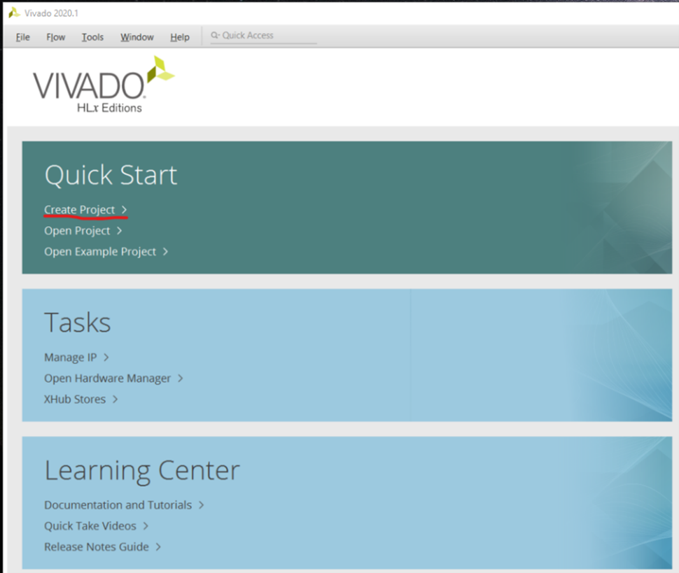
</p>

3. Type the project name as "Lab5\_RR" and select "Next"

<p style="text-indent:50px">
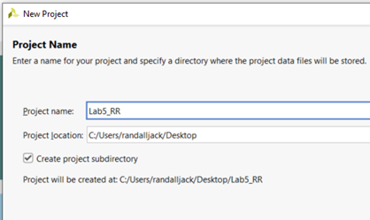
</p>

4. Select RTL Project and then "Next"

<p style="text-indent:50px">
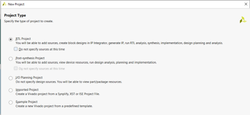
</p>

5. Select "Add Files" and navigate to the "Lab5\_RR.sv" file you downloaded from the "Lab5" Canvas module. Click on the file and select OK.

<p style="text-indent:50px">
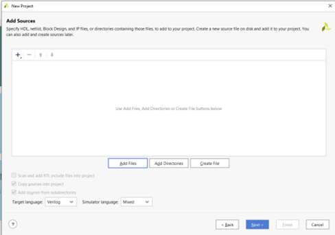
</p>

6. Skip the "Add Constraints" option and just select "Next"

7. There are too many FPGA's to choose from! You need to configure the project with the correct FPGA filter Settings:

- Family: Artix-7.
- Package: cpg236
- Speed: -1

8. Now you can easily find and select "**xc7a35tcpg236-1**" and then
**"Next"**.

<p style="text-indent:50px">
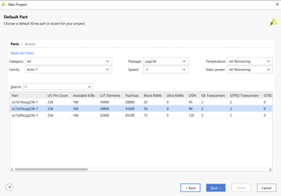
</p>

9. To Create the project, select "Finish".

<p style="text-indent:50px">
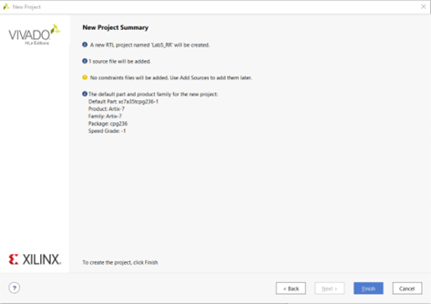
</p>

10. Open the "Lab5\_RR.sv" within Vivado file by clicking on
"Lab5\_RR\_top" in the Sources window.

<p style="text-indent:50px">
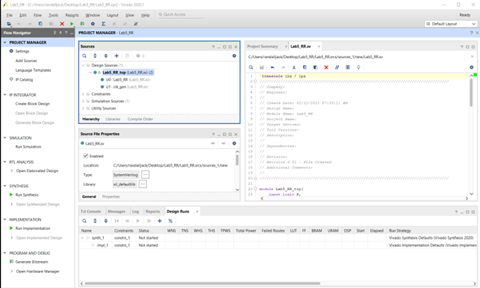
</p>

11. There are 3 modules within this file, Lab5\_RR\_top, Lab5\_RR,
and clk\_gen. You will only edit Lab5\_RR:

-   Observe that the input ports and the output ports that are listed at
    the top of the Lab5\_RR module. These are the signals you will "pass
    in" and "pass out" of the module.

-   Observe that there are two "not" gates, six "and" gates, and two
    "or" gates. Your objective is to add the signal names to each of the
    gates.

    - Start by naming all the internal wires that are not connected to a port. Use names that make sense, like:
        
        ```
        not (Leftb, Left);
        and (SR, Stop, Right);
        ```
        
        where "Leftb" is the inverted "Left" signal and "SR" is the "and" of Stop and Right.

    -   After you have completed the circuit description, declare all
        the new signals (like "SR"). Put these declarations between the
        ports and the logic gates:\
       
        logic Leftb, SR, ...

12. Click on "Run Synthesis" on the side menu. Wait for the synthesis
to complete. This can take a while.

<p style="text-indent:50px">
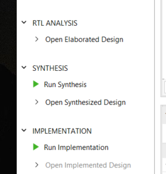
</p>

13. If there were no errors, open the elaborated design (side menu),
and click on the schematic symbol at the top of the Vivado screen.

<p style="text-indent:50px">
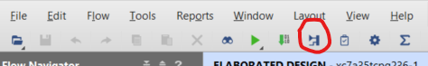
</p>

14. You will see a schematic diagram of the elaborated design. To
open your part of the design, click on the "+" sign in the box labeled
"Lab5\_RR". You should be able to see how Vivado interprets your
SystemVerilog code.

<p style="text-indent:50px">
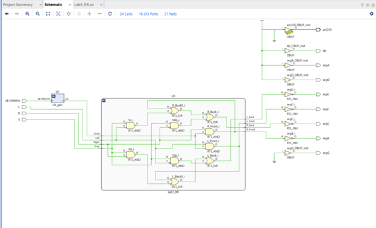
</p>

15. We need to tell Vivado which pins to use on the FPGA chip. Click
on the blue "16 I/O Ports" at the top of the schematic menu. Type the
following information into the I/O Ports list. This tells Vivado how
to map the signal to the switches, seven segment display, and the
clocks. It also tells Vivado to use 3.3V by selecting the "LVCMOS33"
for the I/O Std of each of these signals.

<p style="text-indent:50px">
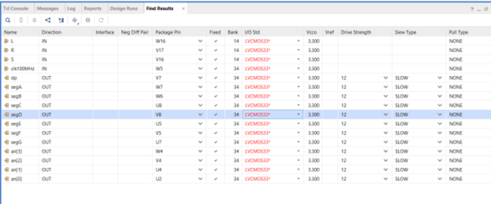
</p>

16. Now re-run the synthesis. You will be prompted to save the configuration file (constraint file). Call it "Lab5\_RR".

<p style="text-indent:50px">
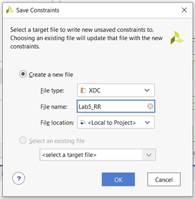
</p>

17. After re-running Synthesis, select "Run Implementation" and open
the implemented design. Open the schematic of the implemented design.
You will see that the implemented design no longer shows AND, OR, and
NOT gates. Instead, it shows that Vivado implemented your design with
several small ROMs or LUTs (Look UP Tables).

<p style="text-indent:50px">
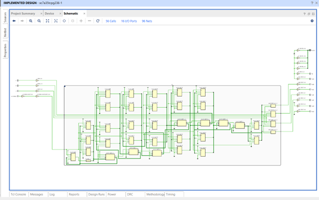
</p>

18. Select "Generate Bitstream" from the bottom of the left menu. This
is turning your design into a file that can be dumped into the FPGA. It
will take a while to generate the bitstream. You can follow the progress
by watching top right of the Vivado window.

19. Connect the ***Basys3*** to the computer using the USB cable and turn on
the ***Basys3*** power switch.

20. Select "Open Hardware Manager" from the bottom of the left menu,
and select "Open Target", then "Auto Connect". Once the computer has
connected to the ***Basys3***, you are ready to dump the configuration data
into the FPGA. Select "Program Device".

<p style="text-indent:50px">
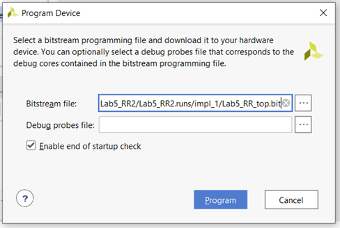
</p>

You are now running the design on the ***Basys3***! Use the three switches on the bottom right as your "Left", "Stop", and "Right" signals. The car lights are shown on the seven-segment display.

## Optional Simulation

Generally, a complex design will require several simulations before you are ready to synthesize your design. To run a simulation on your circuit, you will need to create a test bench. This is a file that emulates the switches on the ***Basys3*** board so that a simulation of the outputs can be done. A testbench file has already been created, called "Lab5\_RR\_tb.v". Download this file from the Lab5 module in Canvas and add it to your project as follows:

<p style="text-indent:50px">
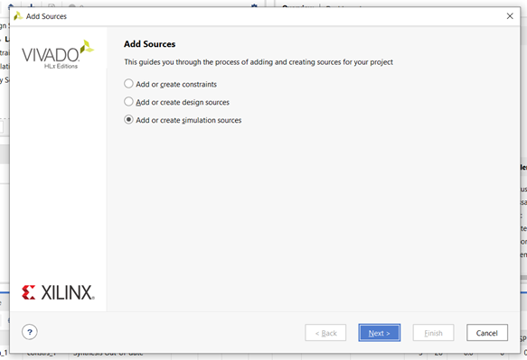
</p>

Select "Add a Source" from the side menu, then select the "Add or create
simulation sources" button.

<p style="text-indent:50px">
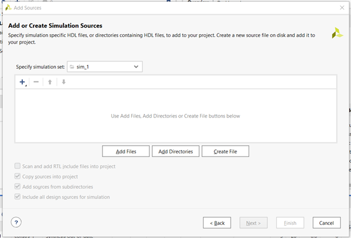
</p>

Select "Add Files" or click on the "+" button".

<p style="text-indent:50px">
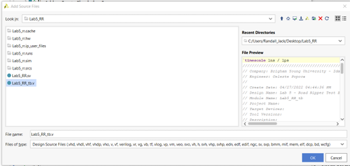
</p>

Navigate to the location you placed the "Lab5\_RR\_tb.v" file and add it
to your design.

<p style="text-indent:50px">
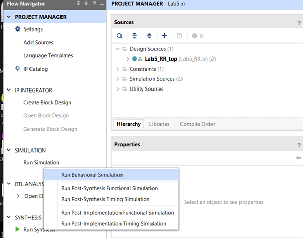
</p>

## Run A Behavioral Simulation

After the simulation runs, select the Untitled 1 tab and expand the
window (the square on the top right).

<p style="text-indent:50px">
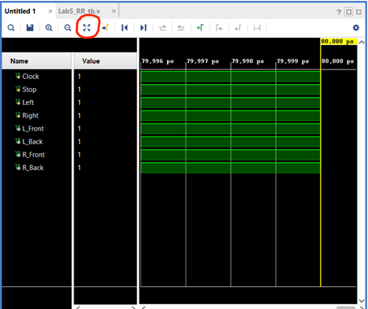
</p>

To zoom out to full view, click on the button with four diverging
arrows. If the simulation looks like the above screenshot, the
simulation is not yet done.

<p style="text-indent:50px">
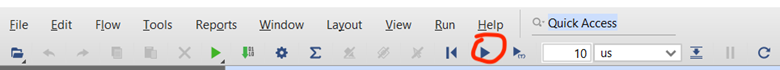
</p>

To finish the simulation, click on the "run simulation" button (shown
above).

<p style="text-indent:50px">
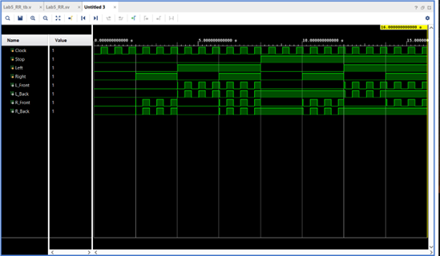
</p>

Zoom to fit (the four diverging arrows) and see if you can understand
the simulation results!
