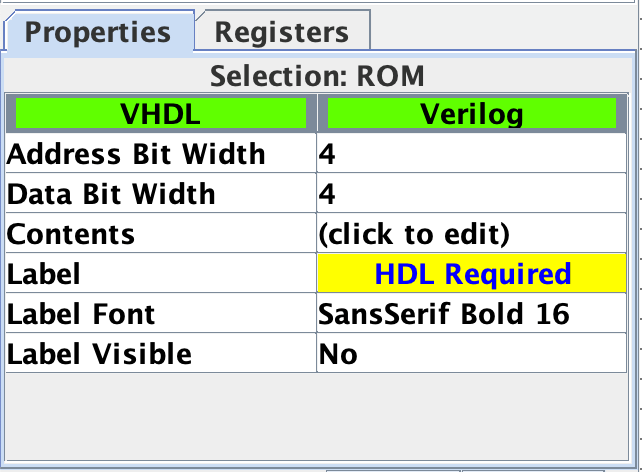
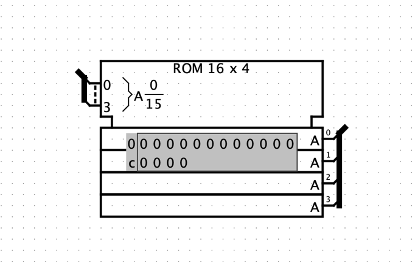
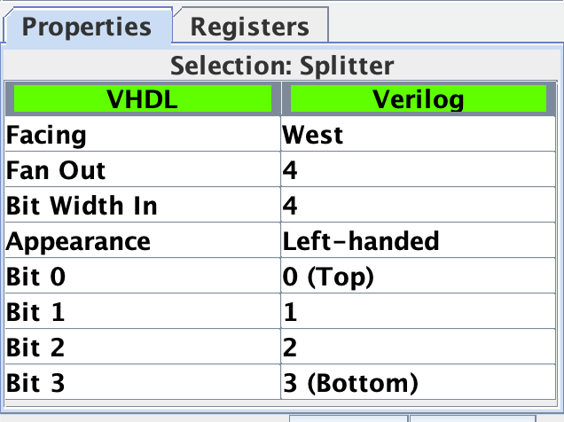
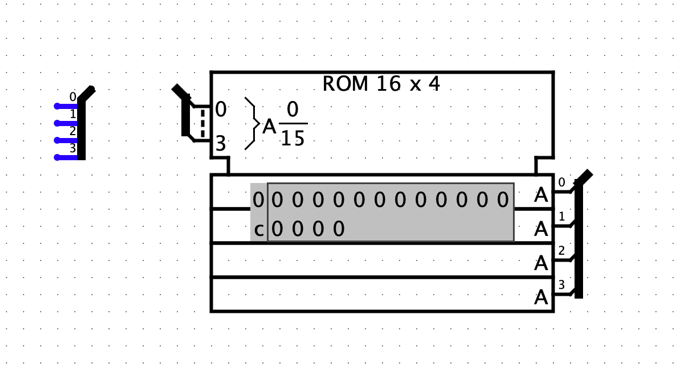

> **Installing Vivado HLX Design Tools**

1.  **Introduction**

    1.  Overview
        --------

        1.  **Purpose**

> These are instructions to install the WebPACK edition of the Vivado
> Design Tools by Xilinx. The point of these instructions is to simplify
> the process of installing the development software and also provide
> possible solutions for problems that may arise during the install.
> System requirements are listed in section 2.

Audience
--------

> These instructions are written for ECEN 240 and ECEN 340 students so
> they can install the development software on their own computers. They
> can also be used by anyone who wishes to install this specific
> development suite on their computer.

Scope
-----

> These instructions will only cover how to install Vivado and how to
> activate the software on Windows. Installation on Linux, while
> supported by Xilinx, will not be covered in these instructions. We
> will be using version 2019.2 for these instructions. Later versions of
> Vivado can be installed by following these instructions, just click
> the download link for the version that you want to install. Previous
> versions of Vivado can also be installed by following these
> instructions. Screenshots are for installing version 2019.2 and the
> installation procedure is the same for later versions

Definitions
-----------

> FPGA: Field Programmable Gate Array, a circuit capable of being
> configured by a developer to function as specified by the developer.

2.  List of Materials
    =================

    1.  Computer Requirements
        ---------------------

-   64-bit Windows 7, 64-bit Windows 8, 64-bit Windows 8.1, or 64-bit
    Windows 10

-   A dual-core processor (minimum)

-   4 GB of RAM (minimum)

-   10-15 GB free hard drive space

    1.  Additional Materials
        --------------------

```{=html}
<!-- -->
```
-   A fast internet connection capable of download speeds of at least 1
    MB/s. Faster is preferred.

-   An FPGA board using an Artix-7 chip.

    -   Note: While this is not necessary for the installation, it will
        be necessary for development after installation.

Directions
==========

NOTE: THE INSTALLATION TAKES BETWEEN 1 TO 3 HOURS MAKE SURE YOU WILL HAVE THE TIME ANDA RELIABLE INTERNET CONNECTION FOR THE ENTIRE PROCESS.
============================================================================================================================================

Downloading the Vivado Installer
--------------------------------

1\) Go to
[[www.xilinx.com/support/download.html]{.underline}.](http://www.xilinx.com/support/download.html)

2\) Scroll down to the "Vivado Design Suite - HLx Editions - 2019.2"
section.

> 3\) Click on the "Xilinx Unified Installer 2019.2: Windows Self
> Extracting Web Installer" as shown in Screenshot 1.
>
> {width="6.652777777777778in"
> height="5.846527777777778in"}
>
> **Screenshot 1: Download page for Vivado 2019.2.**
>
> 4\) On the following page, if you do not have a Xilinx account, click
> create account on the right- hand side. If you already have a Xilinx
> account, skip to step 11.

5\) Fill out the form and be sure to write down this information.

**[Use your student email as the requested email account]{.underline}**

6\) Click "Create Account".

7\) An activation e-mail will be sent to the e-mail address that you
specify. Check your e-mail. 8) Open the e-mail from
"noreply\@xilinx.com."

9\) Click the link in the e-mail.

10\) It will ask you to create a password. Note: The password must be at
least 8 characters long, and must contain at least 1 Capital letter, 1
number, and 1 special character.

a\. Sign in with your username and password.

> 11\) Return to the downloads link
> ([www.xilinx.com/support/download.html)](http://www.xilinx.com/support/download.html))
> and click on "Xilinx Unified Installer 2019.2: Windows Self Extracting
> Web Installer" as shown in Screenshot 1.

a)  A new tab will open asking for information

b)  Fill out your First and Last Name

c)  Use your student email as the corporate E-mail

d)  Company Name is BYU-Idaho

e)  Address is the schools address: 525 S Center St, Rexburg, ID 83460

f)  Job Function select Student

g)  Primary Market is Consumer

h)  The info should look like the screenshot below

i)  Once all information is entered click on the "Download" button

> {width="6.652777777777778in"
> height="6.620833333333334in"}

12\) If all information is correct an installer should download. Once it
has completed its download run the installer

Installing Vivado WebPACK
-------------------------

> 13\) The following window below should open, select next
>
> {width="6.652777777777778in"
> height="5.147916666666666in"}

14\) in the next step it will ask for a "User ID" and "Password" enter
your Student Email and the Password you created in step 10 of these
instructions.

Make sure "Download and Install Only" is the selected option. Click
next.

{width="6.652777777777778in"
height="5.138888888888889in"}

15\) In the next step agree to all the License Agreements and click Next

{width="6.652777777777778in"
height="5.120833333333334in"}

16\) Select **[VIVADO]{.underline}** as the product to install. And
click Next

{width="6.652777777777778in"
height="5.1194444444444445in"}

17\) Select "**[Vivado HL WebPACK]{.underline}**" and click Next.

{width="6.652777777777778in" height="5.125in"}

18\) Select Next in the next step to install the default tools

19\) select Next in the next step to allow for the default install
destination

20\) If a pop-up asking to create Xilinx select "Yes"

21\) click on the "Install" button.

**[MAKE SURE YOU HAVE AN INTERNET CONNECTION FOR THE
INSTALLATION]{.underline}**

{width="6.652777777777778in"
height="5.1618055555555555in"}

22\) Wait for the download and installation to complete.

23\) When prompted to remove all Xilinx devices and cables from the
computer, do so.

24\) Click next.

25\) When prompted to install drivers, click install.

> Note: You may get multiple prompts to install drivers.

26\) Vivado should now be installed and working on your computer, if not
proceed to troubleshoot.

> 27\) After installation completes, Vivado will open up or you can open
> it with the "Vivado 2019.2" shortcut on your desktop. If it doesn't
> open but a window opens prompting you to repair Visual C++ 2012

Redistributable, go to Troubleshooting 4.1. If you are running Windows
10 version 17.09, go to troubleshooting 4.2

4.  Troubleshooting
    ===============

    1.  A window opens prompting to repair Visual C++ 2012 Redistributable
        ------------------------------------------------------------------

> This sometimes happens if Microsoft Visual Studio is also installed on
> the computer. Generally, if this problem occurs, it happens when you
> are trying to activate the software. It can happen during general use
> as well. The following steps are to fix this problem.

1\) Open Windows Explorer and go to the directory where you installed
Vivado.

> Note: The default directory is "C:\\Xilinx"

2\) Within the "Xilinx" directory navigate to
Vivado\\2019.2\\tps\\win64.

> Note: If you used the default directory, the full path will be
>
> "C:\\Xilinx\\Vivado\\2019.2\\tps\\win64".
>
> 3\) Locate the file "xvcredist.exe" and rename the file to something
> else. Here, in Screenshot 6, it was renamed to "NULLxvcredist".
>
> {width="5.598094925634296in"
> height="3.473957786526684in"}
>
> **Screenshot 6: Renaming xvcredist.exe.**

4\) Vivado should now launch.

> 5\) If you had this issue while trying to launch the Xilinx license
> manager during installation, open Start and search for "Manage Xilinx
> Licenses" then proceed to step 25 in the instructions.

Vivado won't launch on the Windows 10 Fall Creators Update (Version 1709)
-------------------------------------------------------------------------

> Vivado 2017.3 and earlier was not designed to run on Windows 10
> version 1709. As a result of this, it will fail to launch.
> Fortunately, there was a workaround discovered which allows for
> launching the program normally.

1\) Navigate to the directory where Vivado is installed.

> 2\) Within the "Xilinx" directory, navigate to
> "Vivado\\2017.3\\bin\\unwrapped\\win64.o" Note: Replace "2017.3" with
> the version number of Vivado that you plan to fix

3\) Rename "vivado.exe" to "vivado.exe.backup"

Note: This requires file name extensions to be visible in the file
explorer 4) Copy "vivado-vg.exe" from the same folder and paste it into
the same folder.

5\) Rename the copied file to "vivado.exe"

6\) Vivado should launch normally now.
