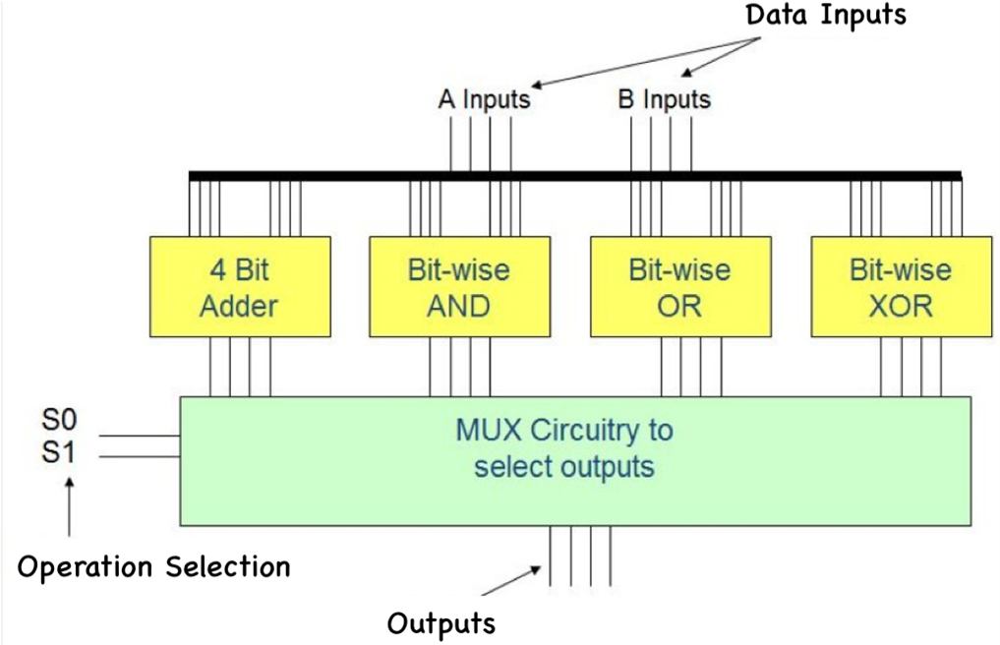
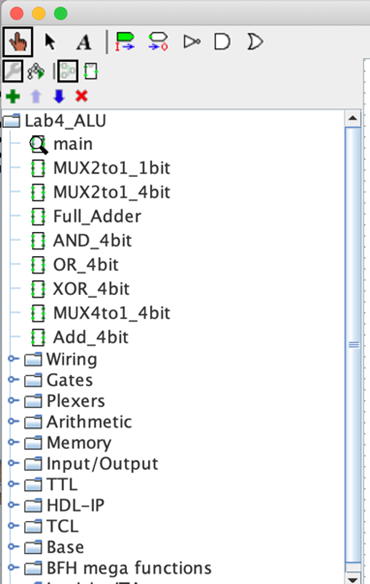
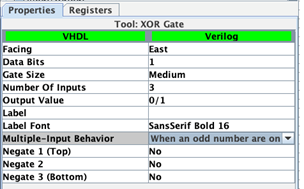
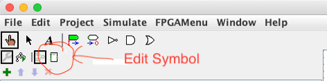
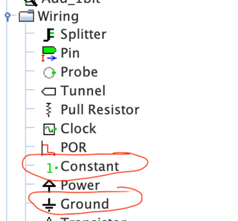

# ECEN 240 - Lab 6 -- Arithmetic Logic Units (ALUs) and Multiplexers

### NAME:  <span style="color:red;">    [insert your name here]
</span>

## Purposes:

1.  Learn how to build multiple-bit multiplexers.
2.  Become familiar with the design and operation of common ALU components.
3.  Learn how to design complex circuits using a hierarchical approach.
4.  Learn about the basic functionality of an ALU
5.  Learn the SystemVerilog "Dataflow" programming style (assign statements)

## Procedure:

In this lab, you will design and built an ALU that can take two,
four-bit numbers (nibbles) as inputs and generate one four-bit number
as the output. The ALU will be able to take the two input nibbles and
ADD them together, OR them together, AND them together, or XOR them
together. The output multiplexer will select only one of these four
functions to send to the output of the ALU. The block diagram of the
completed ALU is shown below:

<p style="text-indent:30px">

</p>

### Lab 6 Part 1 - Getting started with the ALU circuit

#### Building a Hierarchical Design with Subcircuits

There is a lot of logic required to implement this ALU. The complete
circuit is too cumbersome to draw on only one page. The use of
subcircuits will make the over-all circuit more manageable. An ALU
template has been created with "Lab6_ALU" as the main circuit.

The following subcircuits are placed in "Lab6_ALU" in the following
hierarchy:

-   Add_4bit (this subcircuit will consist of four "Full_Adder" subcircuits)

    -   Full_Adder

        -   One 3-input XOR gate

        -   Three 2-input AND gates

        -   One 3-input OR gate

-   AND_4bit

    -   Four 2-input AND gates

-   OR_4bit

    -   Four 2-input OR gates

-   XOR_4bit

    -   Four 2-input XOR gates

-   MUX4to1_4bit

    -   Three MUX2to1_4bit subcircuits

        -   Four MUX2to1_1bit subcircuits


> As a starting point for this lab, all the subcircuits of this ALU
> project have been created are contained in the template file called
> "Lab6\_ALU". Each subcircuit is empty (except for the inputs and
> output) and you are tasked with completing each subcircuit and the
> main circuit. Double-click on them to edit them or single-click on
> them to add them to another higher-level circuit (you could have made
> these subcircuits yourself using the "Project/Add Circuit" menu at the
> top of Logisim Evolution).

<p style="text-indent:50px">

</p>

#### Building the "Full_Adder" circuit

*Before building the complete 4-bit adder, you must first build the subcircuit for the one-bit adder:* 

-   Double click on the "Full\_Adder" circuit in the left menu

-   Implement the one-bit adder circuit as shown in **Figure 9.2** of the
    textbook.

-   The XOR gate has an option called \"Multiple-Input Behavior". This
    needs to be set to "When an odd number are on":
<p style="text-indent:50px">

</p>


-   The input pin names are: A, B, Cin

-   The output pin names are: Cout, S

    -   At some point, you will be placing the symbol for this subcircuit in the four-bit adder. If you wish, you may make the symbol look more like the full-adder symbols used in **Figure 9.1** of the textbook, or you may prefer a different symbol arrangement. To edit the symbol, select the "edit symbol" icon from the top menu:

<p style="text-indent:100px">

</p>

-   There is no test vector for this, so you should verify that your circuit is functioning correctly by comparing its operation to the truth table of **Figure 9.2**.

**Building the Complete Four-Bit Adder**

> The four-bit adder is constructed of four, Full_Adder subcircuits
> similar to **Figure 9.1** of the textbook.

-   Double click on "Add_4bit" in the left menu

-   Implement the four-bit adder by cascading four, one-bit adders
<p>(similar to **Figure 9.1** of the textbook).

-   The first full-adder that contains the LSB should have the Cin input connected to a constant zero or to ground because there is no need to carry information into the first adder:

<p style="text-indent:50px">

</p>
-   The carry out (Co) of the last full adder that implements the MSB is not connected.

-   When connecting to the splitter wires, take note of the small number that labels each of the bits. The "0" wire is the LSB.

<p style="text-indent:50px">

</p>

-  Test your design

> Expected output of the adder for the following inputs:

<div style="border: 3px solid red; text-align: center; width:25%;">

**ADD4 circuit**

|**Input<p>A**|**Input<p>B**|**Expected<p>Output ADD4**|
|-------------|-------------|--------------------------|
|             |             |       <!--HERE -->       |
|      1001   |      1001   |                          |
|      0000   |      1111   |                          |
|      1111   |      1111   |                          |
|      1010   |      0101   |                          |
|      0010   |      0011   |                          |

</div> <br>

Test the 4-bit adder circuit using the "ALU_ADD_test.txt" test vector file, and paste the screenshot of your results in the box below:


Four-bit adder test results (6 points)

Paste your *Logisim* four-bit adder circuit (including your name) in the box below:


Four-bit adder *Logisim* Circuit (6 points)

\*To Verify Your Work in Part 1, Take Lab 6 Quiz 1**

(Quiz is worth 6 points)

**Lab 6 Part 2 - Completing the ALU Schematics**

**Bitwise Logic Circuits (AND, OR, and XOR)**

Build the subcircuits for the bit-wise AND, OR, and XOR bit-wise
operations.

A bit-wise AND circuit is created using four, 2-input AND gates, where
each AND gate has one of the "A" inputs, and the corresponding "B"
input, wired to its input pins. There will be four outputs of the
bit-wise AND operation. Merge the four outputs with a splitter and
call the pin "AND4".

Record the expected output of a 4-bit bit-wise AND circuit:

<div style="border: 3px solid red; text-align: center; width:25%;">

**AND4 circuit**

|**Input<p>A**|**Input<p>B**|**Expected<p>Output AND4**|
|-------------|-------------|--------------------------|
|             |             |       <!--HERE -->       |
|      1001   |      1001   |                          |
|      0000   |      1111   |                          |
|      1111   |      1111   |                          |
|      1010   |      0101   |                          |
|      0010   |      0011   |                          |

</div> <br>

Repeat the above subcircuit creation process for the OR and XOR
operations (the output names will be OR4 and XOR4, respectively).

<div style="border: 3px solid red; text-align: center; width:25%;">

**OR4 circuit**

|**Input<p>A**|**Input<p>B**|**Expected<p>Output OR4**|
|-------------|-------------|-------------------------|
|             |             |     <!--HERE -->        |
|      1001   |      1001   |                         |
|      0000   |      1111   |                         |
|      1111   |      1111   |                         |
|      1010   |      0101   |                         |
|      0010   |      0011   |                         |

</div> <br>

<div style="border: 3px solid red; text-align: center; width:25%;">

**XOR4 circuit**

|**Input<p>A**|**Input<p>B**|**Expected<p>Output XOR4**|
|-------------|-------------|--------------------------|
|             |             |     <!--HERE -->         |
|      1001   |   1001      |                          |
|      0000   |   1111      |                          |
|      1111   |   1111      |                          |
|      1010   |   0101      |                          |
|      0010   |   0011      |                          |

</div> <br>


If desired, you can test your bit-wise logic circuits with the
provided test-vector files to make sure they function correctly, but
you are not required to include the results in this lab document. You
are also not required to place snapshots of the Logisim circuits for
these 3 subcircuits. The test-vector file names are:

```
    ALU_AND_test.txt
    ALU_OR_test.txt
    ALU_XOR_test.txt
```

**Four-bit Wide 4:1 MUX**

The function of this subcircuit is to select a single, four-bit output
from the results of the four ALU operations (ADD, AND, OR and XOR).

The following is a block diagram of the MUX, but in practice, busses
(splitters) will be used to simplify the appearance of the schematic:

<p style="text-indent:25px">

</p>


#### Build this MUX with the following subcircuits:

-   MUX2to1_1bit - A 1-bit, 2 to 1 MUX as shown in **Figure 10.2** of the textbook.
-   MUX2to1_4bit -- Four MUX2to1_1bit subcircuits as shown in **Figure 10.5**.
-   MUX4to1_4bit -- Three MUX2to1_4bit subcircuits as shown in **Figure 10.4**.

Manually check the circuit to make sure it behaves as expected.

Test the MUX4to1_4bit circuit using the "ALU_MUX_test.txt" test vector file, and paste your results in the box below:

Four-bit wide 4:1 MUX results (6 points)

>  Paste your *Logisim* four-bit wide 4:1 MUX circuit (*including your >    name*) by adding file into the ./media directory and adding the link here:


#### Fill in the following table <br>Four-bit wide 4:1 MUX *Logisim* Circuit (6 points)

|A-Input|B-Input|S-Input| ALU Function|Expected Output|
|-------|-------|-------|-------------|---------------|
|       |       |       |             | <!--HERE -->  |
| 1001  | 1001  |    00 |     XOR     |               |
| 1001  | 1001  |    01 |     AND     |               |
| 1001  | 1001  |    10 |     OR      |               |
| 1001  | 1001  |    11 |     ADD     |               |
| 0000  | 1111  |    00 |     XOR     |               |
| 0000  | 1111  |    01 |     AND     |               |
| 0000  | 1111  |    10 |     OR      |               |
| 0000  | 1111  |    11 |     ADD     |               |
| 1111  | 1111  |    00 |     XOR     |               |
| 1111  | 1111  |    01 |     AND     |               |
| 1111  | 1111  |    10 |     OR      |               |
| 1111  | 1111  |    11 |     ADD     |               |
| 1010  | 0101  |    00 |     XOR     |               |
| 1010  | 0101  |    01 |     AND     |               |
| 1010  | 0101  |    10 |     OR      |               |
| 1010  | 0101  |    11 |     ADD     |               |
| 0010  | 0011  |    00 |     XOR     |               |
| 0010  | 0011  |    01 |     AND     |               |
| 0010  | 0011  |    10 |     OR      |               |
| 0010  | 0011  |    11 |     ADD     |               |


### **Putting Together all of the ALU Subcircuits**
>
> Double-click on "main" and build the complete ALU by placing the
> necessary subcircuits in the required place. All of the
> interconnections will be made with multi-wire busses. Make sure that
> the four functions are connected to the proper mux input:

-   When S = 00 the ALU outputs the bit-wise XOR

-   When S = 01the ALU outputs the bit-wise AND

-   When S = 10 the ALU outputs the bit-wise OR

-   When S = 11 the ALU outputs the 4-bit ADD


<span style="font-weight:bold;color:red;font-size:18px">Take Lab6 Quiz 2</span>
(Link in iLearn Module)

(Quiz is worth 10 points)

### Testing Your Logisim ALU

Manually test your ALU against your expected results. Once you are convinced your implementation is correct, verify its functionality using the "ALU\_test.txt" test-vector file and paste your results below:

ALU Test Vector Results (10 points)

Paste a snapshot of your hierarchical ALU circuit below:

*Logisim Evolution* ALU circuit (10 points)

### Lab 6 Part 3 -- <p>SystemVerilog ALU Using "Dataflow" Programming Style

Download the "Lab6\_ALU" project zip file and follow the instructions in
the "Lab6\_SystemVerilog\_Instructions" document.

Have instructor or lab assistant: <br>
<span style="font-weight:bold;color:red;font-size:18px"> Enter Password for Lab 6 Quiz 3 </span>
<br> to pass off the SystemVerilog lab
(15 points)

> Copy and paste your SystemVerilog code here
```


```
*SystemVerilog* ALU Code (15 points)

## Conclusions Statement

> Write a brief conclusions statement that discusses the original
> purposes of the lab found at the beginning of this lab document.

-   Are your thoughts on the hierarchical design approach? Advantages?  Disadvantages?


-   You have designed a four-function ALU. What other types of functions do you think would be useful for an ALU?


-   What are the important aspects to note regarding the construction of multiple-bit multiplexers?


-   What can you say about the functionality of an ALU (for example, how does the ALU know which operation to perform?

-   What are the advantages and disadvantages of using the "dataflow" programming style of SystemVerilog to implement an ALU?

> Please use complete sentences and correct grammar to express your
> thoughts:

Conclusions Statement (10 points)

Congratulations, you have completed the lab!

You may now submit this document.
