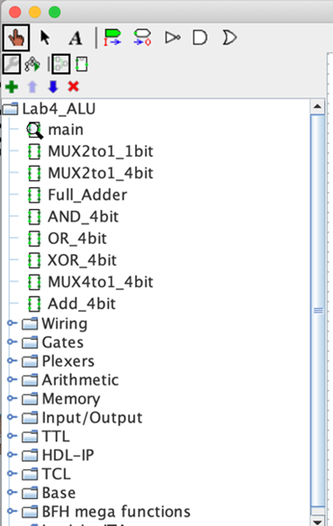

**ECEN 240 Lab 6 - ALU**

**(Vivado and SystemVerilog Instructions)**

> 1\. Download the Lab6\_ALU.sv file from canvas and place on your
> desktop. You will use this momentarily.
>
> 2\. Start Vivado and Select "Create Project"

{width="4.408952318460193in" height="3.725in"}

> 3\. Type the project name as "Lab6\_ALU" and select "Next"

{width="5.083333333333333in"
height="3.0043799212598423in"}

> 4\. Select RTL Project and then "Next"

{width="5.103478783902013in" height="2.35in"}

5\. Select "Add Files" and navigate to the "Lab6\_ALU.sv" file you
downloaded from the "Lab6" Canvas module. Click on the file and select
OK.

{width="5.080232939632546in"
height="3.558333333333333in"}

6\. Skip the "Add Constraints" option and just select "Next"

7\. Configure the project with the correct FPGA filter Settings:

-   Family: Artix-7.

-   Package: cpg236

-   Speed: -1

> 8\. Select "xc7a35tcpg236-1" and then "Next".
>
> {width="4.958333333333333in"
> height="3.4734798775153104in"}
>
> 9\. To Create the project, select "Finish".
>
> {width="4.875in" height="4.164062773403325in"}
>
> 10\. Open the "Lab6\_ALU.sv" within Vivado file by clicking on
> "Lab6\_ALU" in the Sources window.
>
> {width="5.0in" height="3.0037390638670165in"}
>
> 11\. There are 6 modules within this file, Lab6\_ALU, ADD4, AND4, OR4,
> XOR4, and MUX4bit\_4to1. You will all five of these modules:

-   Lab6\_ALU is the top level. All other modules are "placed" or
    "instantiated" in this module. Each of the modules are wired
    together using the structural coding style of SystemVerilog. This
    module also has ports that connect to the switches, pushbuttons and
    LEDs on the Basys3 board.

-   ADD4, AND4, OR4, XOR4 each have one assign statement. For example,
    to perform the add function in the "ADD4" module, type:\
    \
    assign out = A + B;

-   MUX4bit\_4to1 will be implemented with three, 2to1 four-bit
    multiplexors.

12\. Open the elaborated design (side menu). Once this is done, click on
the schematic symbol on the side menu (under RTL ANALYSIS) or at the top
of the Vivado screen.

{width="4.938188976377953in"
height="0.7605227471566054in"}

13\. You will see a schematic diagram of the synthesized design. To view
the various modules of your part of the design, click on the "+" of each
of the modules to expand their views. You should be able to see your
elaborated schematic.

{width="6.5in" height="3.83125in"}

14\. Tell Vivado which pins to use on the FPGA chip. Click on the blue
"14 I/O Ports" at the top of the schematic menu. Type the following
information into the I/O Ports list. This tells Vivado how to map the
signal to the switches, seven segment display, and the clocks. You also
need to tell Vivado to use 3.3V by selecting the "LVCMOS33" for the I/O
Std of each of these signals.

{width="6.5in" height="3.207638888888889in"}

15\. Now run the synthesis step (side menu). You will be prompted to
save the configuration file (constraint file). Call it "Lab6\_ALU".

{width="3.16875in" height="3.2558398950131235in"}

16\. After successfully running Synthesis, select "Run Implementation"
and open the implemented design. Open the schematic of the implemented
design. You will see that the implemented design no longer shows basic
function of each module. Instead, it shows that Vivado implemented your
design with several small ROMs or LUTs (Look UP Tables).

{width="6.5in" height="3.3513888888888888in"}

17\. Select "Generate Bitstream" from the bottom of the left menu. This
is turning your design into a file that can be dumped into the FPGA. It
can take a while to generate the bitstream. You can follow the progress
by watching top right of the Vivado window.

18\. Connect the Basys3 to the computer using the USB cable, and turn on
the Basys3 power switch.

19\. Select "Open Hardware Manager" from the bottom of the left menu,
and select "Open Target", then "Auto Connect". Once the computer has
connected to the Basys3, you are ready to dump the configuration data
into the FPGA. Select "Program Device".

{width="5.0875in" height="3.4220483377077864in"}

You are now running the ALU on the Basys3!

-   Use the four switches on the far left for your "A" input number

-   Use the four switches on the far right for your "B" input number

-   Use the left pushbutton as the "S\[0\]" input

-   Use the right pushbutton as the "S\[1\]" input

-   View the output on the middle four LEDs (above the switches)
