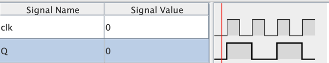

ECEN 240 - Lab 8 -- Sequential Circuits -- Latches and Flip Flops
=================================================================

Name: 
=====

\_\_\_\_\_\_\_\_\_\_\_\_\_\_\_\_\_\_\_\_\_\_\_\_\_\_\_\_\_\_\_\_\_\_\_\_\_\_\_\_\_\_\_\_\_\_\_\_\_\_\_\_\_\_\_\_\_\_\_\_\_\_\_\_\_\_\_\_\_\_
============================================================================================================================================

Purposes:
=========

1.  Become familiar with:

> SR (SC) Latches Gated D Latches D Flip Flops

2.  Be able to read and implement transition tables for latches

3.  Build D Flip Flops in SystemVerilog

4.  Learn how to implement flip flops using SystemVerilog

Procedure:
==========

This lab uses *Logisim* *Evolution* to simulate latches and Flip Flops,
and then implements the Flip Flop circuits in SystemVerilog.

This lab uses *Logisim* *Evolution* to simulate memory elements (latches
and flip-flops), then SystemVerilog is used to build the flip flop
circuits.

-   In part 1 you will simulate three different latch circuits all in
    one *Logisim* file. Keep the latch circuits in one file so you can
    more easily compare their behavior.

-   In part 2 you will simulate a D flip flop circuit and a D flip flop
    toggle circuit. You should build these two circuits in one file.

-   In part 3 the flip flop circuits will be built using SystemVerilog.

**Part 1 -- Latches and Gated latches**

**NOR SR Latches**

> The S and R signals of a NOR-based latch are normally set to "0". One
> of the two signals must transition from low-high in order for
> something to change at the outputs. You can better understand the
> meaning of this transition table if you let the high-going pulse be
> substituted for the "1" in section 15.1 of the textbook, suggesting
> that *Q* takes on the value of *Q+* as the appropriate *S* or *R*
> signal transitions from 0 to 1. The latch retains its value even after
> transitioning back to its normal value of "0".
>
> The NOR-based latch circuit of figure 15.1 of the textbook results in
> the truth (or transition) table shown below (compare with figure 15.4
> of the textbook):

  NOR-Based SR Latch                                                                                                                                                                                                                                               
  ------------------------------------------------------------------------------------ ------------------------------------------------------------------------------------ --------------------------------- -- ---------------------------------- ------ -- ---- -----
  Inputs (for brevity, Q' not shown)                                                                                                                                        Expected Next State of Q and Q'      Simulated Next State of Q and Q'                  
  S                                                                                    R                                                                                    Q                                    Q+                                 Q'+       Q+   Q'+
                                                                                                                                                                                                                                                                   
  0                                                                                    0                                                                                    0                                    0                                  1              
  0                                                                                    0                                                                                    1                                    1                                  0              
  0                                                                                    {width="0.2361111111111111in" height="0.18055555555555555in"}   0                                    0                                  1              
  0                                                                                    {width="0.2361111111111111in" height="0.18055555555555555in"}   1                                    0                                  1              
  {width="0.2361111111111111in" height="0.18055555555555555in"}   0                                                                                    0                                    1                                  0              
  {width="0.2361111111111111in" height="0.18055555555555555in"}   0                                                                                    1                                    1                                  0              
  1                                                                                    1                                                                                    0                                    *NA*                               *NA*           
  1                                                                                    1                                                                                    1                                    *NA*                               *NA*           

> For the invalid input conditions in the above table, *NA* means "Not
> Allowed".
>
> Build the NOR latch circuit in *Logisim*, simulate the circuit, and
> record your results in the "Simulated Next State" column of the above
> table. This time, use the actual simulated values of the outputs for
> all cases (don't use *NA*).
>
> Use the following pin names in your *Logisim* circuit:

  Input Pins      Output Pins
  ------------ -- -------------
                  
  S\_NOR          Q\_NOR
  R\_NOR          Qn\_NOR

> Note that you will not be able to test latches and flip flops like you
> did combinational logic (where you might have gone sequentially
> through each line of the truth table). The output is not just
> dependent on the setting of the inputs. The output is dependent on the
> state of the inputs and the previous state of the output. You will
> need to do some extra input manipulation (setting or clearing the
> latch or flip flop) to get the Q output to what it needs to be to test
> a particular input condition.
>
> You can verify the signals are connected correctly by testing your
> circuit with the "NOR\_Latch\_test.txt" test vector file, but there is
> no need to submit the results until all three latches are constructed.

**NAND S'R' Latches**

> The NAND latch isn't discussed in the textbook, but it is simple to
> draw the NAND latch from the NOR latch schematic. Simply replace the
> NOR gates with NAND gates, change the *S*, *R* signals to *S'* and
> *R'*, and swap the *Q* and *Q'* outputs as shown:

{width="4.4154046369203845in"
height="1.6222047244094489in"}

> The NAND latch input signals are complemented relative to the NOR
> latch. The *S'* and *R'* signals of the NAND-based latch are normally
> set to "1". One of the two signals must transition from high-low in
> order for something to change at the outputs. You can better
> understand the meaning of the NAND latch transition table if you let
> low-going pulse be substituted for the "0" in the transition table,
> suggesting that *Q* takes on the value of *Q+* as the appropriate *S'*
> or *R'* signal transitions from 1 to 0. The latch retains its value
> even after transitioning back to its normal value of "1".
>
> Before you build the NAND latch, predict the expected next states of
> the outputs and fill out the "Expected Next State" column of the table
> below (don't fill out the "Simulated" column yet):

  NAND-Based S'R' Latch                                                                                                                                                                                                                                          
  ------------------------------------------------------------------------------------ ------------------------------------------------------------------------------------ --------------------------------- -- ---------------------------------- ------ -- -- --
  Inputs (for brevity, Q' not shown)                                                                                                                                        Expected Next State of Q and Q'      Simulated Next State of Q and Q'                
  S\_not                                                                               R\_not                                                                               Q                                    Q+                                 Q'+          
                                                                                                                                                                                                                                                                 
  0                                                                                    0                                                                                    0                                    *NA*                               *NA*         
  0                                                                                    0                                                                                    1                                    *NA*                               *NA*         
  {width="0.2361111111111111in" height="0.20833333333333334in"}   1                                                                                    0                                                                                    
  {width="0.2361111111111111in" height="0.20833333333333334in"}   1                                                                                    1                                                                                    
  1                                                                                    {width="0.2361111111111111in" height="0.20833333333333334in"}   0                                                                                    
  1                                                                                    {width="0.2361111111111111in" height="0.20833333333333334in"}   1                                                                                    
  1                                                                                    1                                                                                    0                                                                                    
  1                                                                                    1                                                                                    1                                                                                    

> For the invalid input conditions in the above table, *NA* means "Not
> Allowed".
>
> After you predict the expected outputs, build the NAND latch circuit
> in the same *Logisim* circuit file as the NOR latch (there is no need
> to build sub-circuits). Simulate the circuit and record your simulated
> results in the "Simulated Next State" column of the above table (use
> the actual simulated values of the outputs for all cases, don't use
> *NA*).
>
> Use the following pin names in your *Logisim* circuit:

  Input Pins      Output Pins
  ------------ -- -------------
                  
  Sn\_NAND        Q\_NAND
  Rn\_NAND        Qn\_NAND

> Remember that you will need to do some extra \"button clicking\" to
> get the *Q* output to the proper state on the input side of the
> transition table.
>
> You can verify the signals are connected correctly by testing your
> circuit with the "NAND\_Latch\_test.txt" test vector file, but there
> is no need to submit the results until all three latches are
> constructed.

**Gated D Latches**

> Consider the Gated of Figure 15.7 of the textbook. The *S* and *R*
> inputs are replaced by a single *D* input. The inverter eliminates any
> states that are "Not Allowed". The *Gate* signal is normally set to
> "0" and must transition from low-high in order for something to change
> at the outputs. You can better understand the meaning of this
> transition table if you let the high-going pulse be substituted for
> the "1" in Figure 15.9 of the textbook, suggesting that *Q* takes on
> the value of *D* as the *Gate* signal transitions from 0 to 1. The
> latch retains its value even after transitioning the *Gate* back to
> its normal value of 0.
>
> Before you build the Gated D latch, predict the expected next states
> of the outputs (by looking at the circuit in 15.7 of the textbook) and
> fill out the "Expected Next State" column of the table below (don't
> fill out the "Simulated" column yet):

  Gated D-Latch                                                                                                                                                                      
  ------------------------------------------------------------------------------------ --- ----------------------------------- -- ------------------------------------ ----- -- ---- -----
  Inputs (for brevity, Q' not shown)                                                       Expected "Next State" of Q and Q'      Simulated "Next State" of Q and Q'                 
  Gate                                                                                 D   Q                                      Q+                                   Q'+      Q+   Q'+
                                                                                                                                                                                     
  0                                                                                    0   0                                                                                         
  0                                                                                    0   1                                                                                         
  0                                                                                    1   0                                                                                         
  0                                                                                    1   1                                                                                         
  {width="0.2361111111111111in" height="0.18055555555555555in"}   0   0                                                                                         
  {width="0.2361111111111111in" height="0.18055555555555555in"}   0   1                                                                                         
  {width="0.2361111111111111in" height="0.18055555555555555in"}   1   0                                                                                         
  {width="0.2361111111111111in" height="0.18055555555555555in"}   1   1                                                                                         

> After you predict the expected outputs, build the NAND latch circuit
> in the same *Logisim* circuit file as the NOR latch (there is no need
> to build sub-circuits). Simulate the circuit, and record your results
> in the "Simulated Next State" column of the table. Use the actual
> simulated values of the outputs for all cases (don't use *NA*). Use
> the following pin names in your *Logisim* circuit:

  Input Pins      Output Pins
  ------------ -- -------------
                  
  Gate            Q\_GateD
  D               Qn\_GateD

> Remember that you will need to do some extra \"button clicking\" to
> get the *Q* output to what it needs to be to test a particular input
> condition.
>
> You can verify the signals are connected correctly by testing your
> circuit with the "Gated\_DLatch\_test.txt" test vector file.
>
> Test your three latches together using the "Latches\_test.txt" test
> vector file, and paste your results in the box below:

  --
  --

Three-Latch test results (10 points)

> Paste your *Logisim* circuit (including your name) in the box below.
> Remember, this design will have all 3 latches (without subcircuits):

  --
  --

Three-Latch *Logisim* Circuit (10 points)

**\*\*\* Take Lab8 Quiz 1 \*\*\***

**(Worth 20 points)\
**

**Part 2 -- Flip Flops**

**D Flip Flop Circuit**

> Consider Figures 15.17 and 15.18 in the textbook to predict the
> expected transition data for a rising edge triggered Flip Flop. Enter
> in your "Expected Next State" data in the table below (don't enter the
> "Simulated Next State" data yet.

  D Flip Flop                                                                        
  ------------------------------------ --- --------------------------------- -- ---- -----
  Inputs (for brevity, Q' not shown)       Expected Next State of Q and Q'           
  CLK                                  D   Q                                    Q+   Q'+
                                                                                     
  ↑                                    0   0                                         
  ↑                                    0   1                                         
  ↑                                    1   0                                         
  ↑                                    1   1                                         

> In this half of the lab, you will create a new *Logisim* file. You
> won't need to build your own D flip flop out of AND, OR, and NOT
> gates! In *Logisim*, the *D Flip-Flop* is found in the \"Memory\"
> folder. To verify the behavior of the D FF, *Logisim* does not require
> that you connect the *S* and *R* pins. Leave them disconnected for
> now.

-   Connect the clock input (the input with the triangle) to a clock
    > source from the wiring menu, and name the clock pin *"clk"*:

{width="1.7204297900262466in"
height="2.3333333333333335in"}

-   Connect the *D* input of the flip flop to a regular input pin and
    > call this signal, *"D".*

-   Connect the output pins, *Q* and *Q\'* to regular output pins called
    > *"Q"* and *"Qn"*.

> The clock pin is unique in Logisim because it is capable of
> automatically cycling through the 1-0-1-0... sequence at the frequency
> you specify! Go to the "Simulate -\> Tick Frequency" menu to set the
> frequency. Pick a frequency like 1Hz (1 cycle per second). Alter this
> frequency as desired. To start the clock, select "Simulate -\> Ticks
> Enabled". If you don't want the clock to "free run", simply turn it
> off, and use the poke tool (the finger) to change the clock state just
> like any other input pin.
>
> Do the following tests on the flip flop circuit:

-   With your clock "free running" at 1Hz, observe what happens when you
    > change the *D* input from 0 to 1 and back again.

-   With the *D* input set to 1 and the clock running at 1Hz, observe
    > what happens when you connect the *R* input of the flip flop to an
    > input pin and manipulate its value from 0-1-0-1....

-   With the *D* input set to 0, *R* set to 0, and the clock running at
    > 1Hz, observe what happens when you connect the *S* input of the
    > flip flop to an input pin and manipulate is value from 0-1-0-1...

-   Observe what happens when you simultaneously set the *R* and *S*
    > pins to 1 (which one wins?).

***D Flip Flop* Toggle Circuit**

> Construct a toggle circuit using a D flip flop in Logisim and examine
> its behavior. Section 15.3 of the textbook shows such a circuit:

{width="0.9583333333333334in"
height="1.0681419510061243in"}

> Note that the above circuit uses a negative edge triggered *D flip
> flop*. For your implementation, use the positive edge triggered
> Logisim *D flip flop* instead. Also, the circuit shows an inverter
> connected from the *Q* output to the *D* input. You can simply use the
> *Q'* output without the inverter.
>
> Verify that the toggle circuit behaves as shown in the timing diagram:
>
> {width="2.9916666666666667in"
> height="0.5756867891513561in"}
>
> This toggle circuit divides a frequency by 2. In other words, the
> frequency seen at the Q output is half that see at the clock input.
>
> *Logisim Evolution* has the capability of showing you a timing diagram
> similar to the one above. To do this:

-   Add one additional clock pin from the wiring menu, and name this pin
    "sysclk". Don't connect this clock to anything, it will be used as a
    reference clock for the Chronogram tool.

-   Select "Chronogram" from the "Simulate" menu.

-   Add one signal at a time to the right-side of the menu as shown. You
    will only need *clk*, *Q*, and s*ysclk*:

{width="3.1171872265966756in"
height="2.1435312773403323in"}

-   Select "Start Chronogram"

-   Each time you click on the clock button (shown below) the waveform
    will advance ½ clock cycle.

{width="0.7777777777777778in"
height="0.6944444444444444in"}

> Paste your Chronogram timing diagram of the Toggle circuit in the box
> below:

  --
  --

Timing Diagram of the Toggle Circuit (10 points)

> Paste your *Logisim* circuit of your flip flop and toggle circuit
> (including your name) in the box below:

  --
  --

Flip Flop Circuits (10 points)

\*\*\*Take Lab8 Quiz 2\*\*\*

(Worth 10 points)

**Part 3 -- SystemVerilog Flip Flops**

**SystemVerilog Flip Flops**

> **Refer to the SystemVerilog instruction document to implement the
> flip flop circuits on a Basys3 board.**
>
> Paste your module that contains the *flip flop "always\_ff" statement
> in the box* below:

  --
  --

Flip Flop Module Code (10 points)

\*\*\*Pass Off the Flip Flop Implementation Using Lab8 Quiz 3\*\*\*

(Worth 10 points)

**Conclusions Statement**

> Write a brief conclusions statement that discusses the original
> purposes of the lab found at the beginning of this lab document.

-   What are some of your observations about: SR Latches, Gated D
    > Latches, and D Flip Flops?

-   What are some or your observations about reading and implementing
    > transition tables?

-   What are your observations about implementing flip flops
    > behaviorally in SystemVerilog?

> Please use complete sentences and correct grammar to express your
> thoughts:

(The conclusions box will expand as you write)

  --
  --

Conclusions Statement (10 points)

Congratulations, you have completed the lab!

You may now submit this document.
