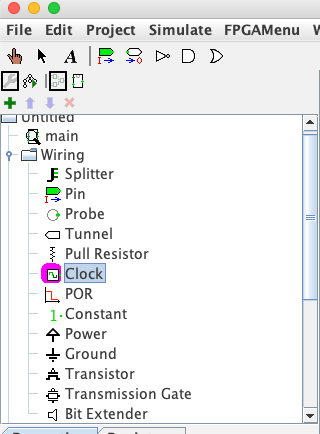

**ECEN 240 Lab 8 - ALU with Flip Flops**

**(Vivado and SystemVerilog Instructions)**

> 1\. Create a Lab8\_ALU\_FF project from the Lab6\_ALU project. To do
> this:

-   Open the Lab6\_ALU project

-   From the "File" menu, select "Project \> Save As" and enter the new
    project name as "Lab8\_ALU\_FF".

> 2\. Download the "clk\_div.v" module file from canvas and add it to
> your project as a source. To do this:

-   Save the "clk\_div.v" module to your desktop

-   Select "Add Sources" sources from the Vivado menu (on the left).

-   Select "Add or create design sources" and click "next".

-   Click on the "Add Files" button

-   Navigate to the "clk\_div.v" file on your desktop and click on the
    "Finish" button.

> 3\. Create a new module file called "Lab8\_ALU\_FF.sv" by doing the
> following:

-   Select "Add Sources" from the left Vivado menu.

-   Select "Add or create design sources" and click "next".

-   Click on the "Create File" button.

-   Select the File type as "SystemVerilog.

-   Enter the file name "Lab8\_ALU\_FF.sv".

-   The File location should be "Local to Project".

-   When you click on the "Finish" button a window opens for you to
    describe the ports. Type the following and then "OK":

{width="6.291666666666667in"
height="6.680555555555555in"}

> 4\. The "seg" signal is 7 bits wide and controls the seven segments in
> the seven segment displays. The "an" signal is four bits wide and
> selects which of the four seven-segment displays will be active. The
> "dp" signal is the decimal point of the seven-segment display.
>
> The seven-segment displays will be used to display the clock signal.
> When the lower signals are on, that represents the low level of the
> clock. When the upper segments are on, that represents the high level
> of the clock. This way, you will be able to "see" the clock operate,
> and you will be able to see when the flip flop should be capturing new
> data.
>
> If you make a mistake, that is fine. Open the "Lab8\_ALU\_FF" text
> file and make the change within the file port list code. A few things
> to check:

-   The "A" and "B" ports are input busses that are 4-bits wide (3 to
    0).

-   The "ALU\_out\_FF" port is an output bus that is declared as a
    4-bits wide (3 to 0).

-   "seg", "an", and "dp" should be the "output" direction.

-   Insert "logic" after the "output" on the "ALU\_out\_FF" signal.

{width="2.7594695975503063in"
height="1.510515091863517in"}

> 5\. Within the of the "Lab8\_ALU\_FF" module, instantiate the
> "Lab6\_ALU" module and the "clk\_div" module as shown:

{width="6.222222222222222in"
height="3.6666666666666665in"}

> 6\. Add flip flops to store the output of the ALU

-   Your Lab6\_ALU will give you a 4-bit output signal. Use this as the
    input to the flip flop, and the output is the 4-bit "ALU\_out\_FF"
    signal.

> 7\. Open the "Elaborated" design schematic.

8\. Tell Vivado which pins to use on the FPGA chip. Click on the blue
"27 I/O Ports" at the top of the schematic menu. Type the following
information into the I/O Ports list. This tells Vivado how to map the
signal to the switches, seven segment display, and the clocks. You also
need to tell Vivado to use 3.3V by selecting the "LVCMOS33" for the I/O
Std of each of these signals (to see how these pin assignments were
made, look at the last figure in this document).

{width="6.5in" height="5.686111111111111in"}

9\. Now run the synthesis step (side menu). If you are prompted to save
the constraint file, call it "Lab8\_ALU\_FF".

10\. After successfully running Synthesis, select "Run Implementation"
and open the implemented design. Open the schematic of the implemented
design. You will see that the implemented design no longer shows basic
function of each module. Instead, it shows that Vivado implemented your
design with several small ROMs or LUTs (Look UP Tables).

11\. Select "Generate Bitstream" from the bottom of the left menu. This
is turning your design into a file that can be dumped into the FPGA. It
can take a while to generate the bitstream. You can follow the progress
by watching top right of the Vivado window.

12\. Connect the Basys3 to the computer using the USB cable, and turn on
the Basys3 power switch.

13\. Select "Open Hardware Manager" from the bottom of the left menu,
and select "Open Target", then "Auto Connect". Once the computer has
connected to the Basys3, you are ready to dump the configuration data
into the FPGA. Select "Program Device".

You are now running the ALU with flip flops on the Basys3!

-   Use the four switches on the far left for your "A" input number

-   Use the four switches on the far right for your "B" input number

-   Use the left pushbutton as the "S\[1\]" input

-   Use the right pushbutton as the "S\[0\]" input

-   View the output on the middle four LEDs (above the switches). This
    output will not update until the rising edge of clk\_slow.

{width="6.5in" height="8.408333333333333in"}
