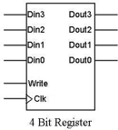

ECEN 240 - Lab 9 -- Register File
=================================

## Name:     [insert your name here]

Purpose:
--------

1.  Become more familiar with:

-   Decoder Usage

-   Loadable D Flip Flop Configurations

-   Multi-bit MUXes

-   SystemVerilog Multi-dimensional Arrays

2.  Learn about a type of memory structure (a register file) used in many processors and in many digital circuits

Background Information
----------------------

> In this lab project, you will implement a 4‐bit by 8 word dual-ported
> register file (it is called "dual-ported" because it has an input port
> and an output port). Note that a register file is one form of a memory
> device. Multi‐ported registers are used as the smallest, but fastest,
> memory component in CPUs. The following block diagram shows the target
> design:

A register files can be addressed for writing or reading. A memory with
*m* address lines will contain 2m locations. For example, a memory with
4 address lines will contain 16 memory locations.

In this project you are asked to complete the design of the dual‐ported
4X8 register file (four bits may be stored in each of the 8 address
locations). It will have 3 write address bits, 3 read address bits, 4
data‐in lines, and 4 data‐out lines. The register file will also have a
write enable signal that will allow a write signal (or load signal) to
be given to a selected register. The register will receive (load) new
data on the rising edge of the clock when its write enable signal is
active.

 A key advantage of a dual ported register file is that writing and
 reading may be performed independently. For example, on a given clock
 cycle you could write data at address location 2 but be reading from
 address location 1!

 There will be 3 major components to this design:

 1\. A 3 to 8 decoder circuit which selects the destination address of
 the data to be written.

 2\. The memory portion of the register file. This will consist of four
 "loadable" D flip flop-based memory elements per memory location. Use
 rising edge triggered D flip flops for your design. For each flip
 flop, you need to be able to control when the flip flop loads a new
 value. Construct "loadable" registers by adding a 2:1 multiplexer to
 each flip flop as shown:

 

 3\. A four-bit multiplexer with 3 select one of the 8 memory locations
 to read.

### **Procedure**

**Part 1**

**Design the Register File Using Logisim Evolution**

> **Download the *LogisimEvolution* circuit file as a starting point for
> the design.**
>
> **Loadable Memory Cells**
>
> **The One-bit Loadable Register**
>
> For the D Flip‐flop and MUX circuit below (a one‐bit loadable
> register), write the transition table and derive a Boolean equation
> which describes the Dout+ signal.

|  Din |  LD |  Dout |  CLK | Dout+ |
|:----:|:---:|:-----:|:----:|:-----:|
|  0   |  0  |  0    |  ↑   |       |
|  0   |  0  |  1    |  ↑   |       |
|  0   |  1  |  0    |  ↑   |       |
|  0   |  1  |  1    |  ↑   |       |
|  1   |  0  |  0    |  ↑   |       |
|  1   |  0  |  1    |  ↑   |       |
|  1   |  1  |  0    |  ↑   |       |
|  1   |  1  |  1    |  ↑   |       |

> Boolean Equation for Dout+ :

>  -------------
>  **Dout+ =**
>  -------------

### **The Four-bit Loadable Register Subcircuit**

 Open the "Four\_bit\_register" subcircuit and build a 4-bit loadable
 register [subcircuit]{.underline} that performs the function of the
 block diagram, below:

 

 It will require four, one-bit wide 2:1 MUXes and four, D flip flops.

 NOTE: Within each 4-bit register, all of the clocks are shared and all
 of the Write (Load) signals are shared.

 Paste your *Logisim* 4-bit loadable register circuit (including your
 name) in the box below (this should consist of 4 multiplexers and 4
 flip flops):

>

4-bit Loadable Register Circuit (20 points)

### **Completed Register File Schematic**

 Connect all of the building blocks of the register file as shown:

 After construction, it is necessary to functionally test your circuit
 (there will be no test vector). Verify that your circuit performs
 properly by testing the following patterns in your register. Since
 memory is involved, you must record your results in the order shown in
 the transition table:

| DataIn  |  Write Address (WA)  |  Write Enable (WE)  |  CLK  | Read Address (RA)  |    DataOut   |
|:-------:|:--------------------:|:-------------------:|:-----:|:------------------:|:------------:|
|  0011   |        000           |          1          |   ↑   |        000         |              |
|  0101   |        001           |          1          |   ↑   |        000         |              |
|  1100   |        010           |          1          |   ↑   |        000         |              |
|  1010   |        011           |          1          |   ↑   |        000         |              |
|  1101   |        100           |          1          |   ↑   |        000         |              |
|  1011   |        101           |          1          |   ↑   |        000         |              |
|  0100   |        110           |          1          |   ↑   |        000         |              |
|  0010   |        111           |          1          |   ↑   |        000         |              |
|  0000   |        000           |          0          |   ↑   |        000         |              |
|  0000   |        000           |          0          |   ↑   |        001         |              |
|  0000   |        000           |          0          |   ↑   |        010         |              |
|  0000   |        000           |          0          |   ↑   |        011         |              |
|  0000   |        000           |          0          |   ↑   |        100         |              |
|  0000   |        000           |          0          |   ↑   |        101         |              |
|  0000   |        000           |          0          |   ↑   |        110         |              |
|  0000   |        000           |          0          |   ↑   |        111         |              |
|         |                      |                     |       |                    |              |

##  \*\*\*Take Lab 9 Quiz 2\*\*\* (This Quiz is worth 20 points) 

 Paste your *Logisim* circuit of your complete register file (including
 your name) in the box below:

 > 
 >Completed Register File Circuit (20 points)

## **Part 2**

**Design the Register File Using SystemVerilog**

 **Refer to the SystemVerilog instruction document to implement the
 Register File on a Basys3 board.**

 Paste your *Register File module code in the box* below:

> 
>Register File Module Code (10 points)

### \*\*\*Pass Off the Register File Implementation Using Lab 9 Quiz 3\*\*\*

(Worth 20 points)

**Conclusions Statement**

> Write a brief conclusions statement that discusses the original
> purposes of the lab found at the beginning of this lab document:

-   How does a Loadable D Flip Flop circuit differ from a simple D Flip
    Flop?

-   What is the purpose of the MUX in the circuit?

-   What is the purpose of the Decoder in the circuit?

-   A Microprocessor uses memory to hold the input and output data of an
    ALU. How might a register file be used in a microprocessor?

-   How doe SystemVerilog simplify the design process of a register
    file?

> Please use complete sentences and correct grammar to express your
> thoughts:

(The conclusions box will expand as you write)

>
>
> 

Conclusions Statement (10 points)

Congratulations, you have completed the lab!

You may now submit this document.
