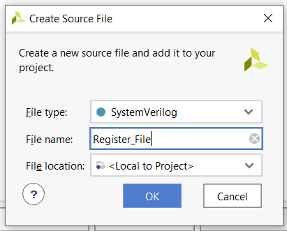
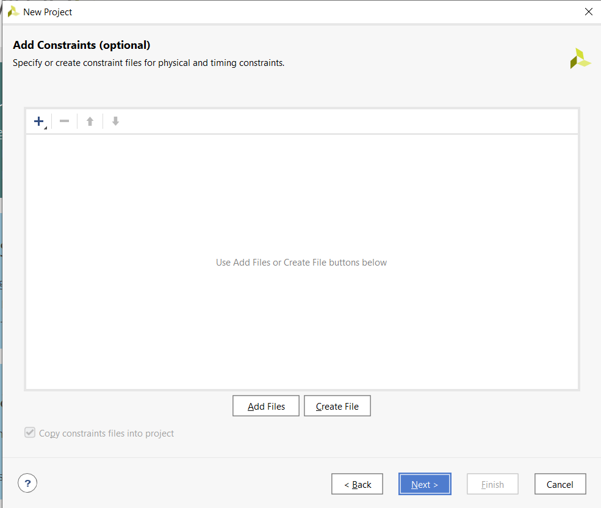
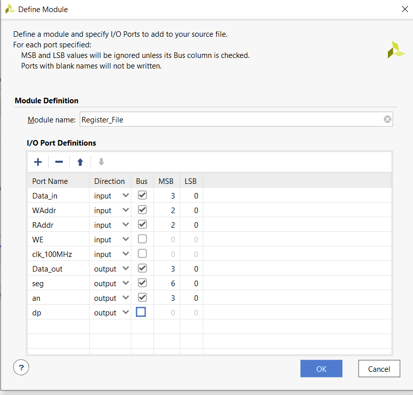
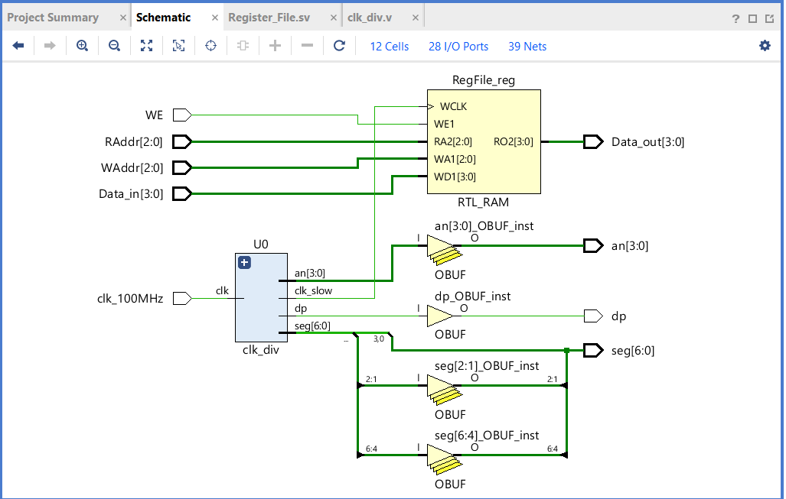
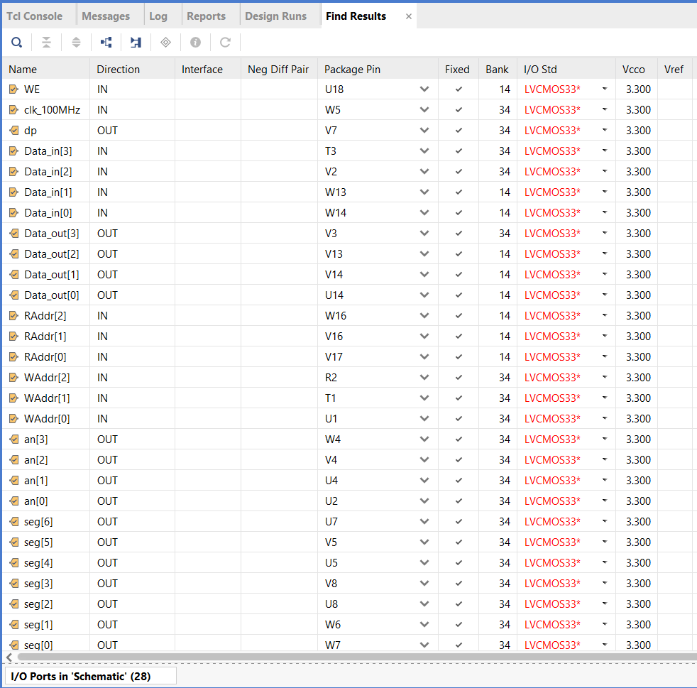

**ECEN 240 Lab 9 -- Register File**

**(Vivado and SystemVerilog Instructions)**

Your objective is to build the register file circuit using the Basys3.
The following switches, LEDs, and button assignments will be made:

{width="4.7802395013123355in"
height="3.50298665791776in"}

Procedure:

> 1\. Download the "clk\_div.v" Verilog module file and the
> "Register\_File.xdc" constraints file from Canvas and place them in a
> convenient place (like your desk top).
>
> 2\. Create a Lab9\_Register\_File project.
>
> 3\. You will add two sources to your design:

-   Create a new SystemVerilog module file called "Register\_File.sv".

-   Add the "clk\_div.v" Verilog module file as a design source.

{width="4.281847112860892in"
height="3.448397856517935in"}

4\. After you have added the two source files, select "Next" and add the
"Register\_File.xdc" as a constraints file. The constraints file will
eliminate the need to create the table with the pin number assignments
(you can always do this later, or if you choose, you can add or alter
the pin connection information manually as in the past).

{width="3.3253280839895014in"
height="2.8087653105861765in"}

5\. Configure the project with the correct FPGA filter Settings:

-   Family: Artix-7.

-   Package: cpg236

-   Speed: -1

> 6\. Select "xc7a35tcpg236-1" and then "Next".
>
> 7\. After selecting the "Finish" button you can opt to set up the
> ports for your "Register\_File" module. You can include the following
> port information, (but remember that you can always change this later
> with the text editor):

{width="3.7196970691163607in"
height="3.5519925634295713in"}

> 8\. Inside of the "Register\_File" module, instantiate the "clk\_div"
> module just as you did in the previous lab. You will use the slower
> clock for your register file.
>
> 9\. With the guidance of Chapter 19.3 of the textbook, design your
> register file as prescribed earlier. Just as with the Logisim
> Evolution schematic, it must have the following specifications:

-   Eight memory locations---each with 4 bits (4X8 memory)

-   Write enable

-   Separate write address and read address

-   Synchronous write (needs a clock to write)

-   Asynchronous read (does not need a clock to read)

> 10\. Open the "Elaborated" design schematic. It should look something
> like this:

{width="4.2042782152230975in"
height="2.673041338582677in"}

11\. Since you added a constraints file, you do not need to tell Vivado
which pins to use on the FPGA chip. You can still click on the blue "28
I/O Ports" at the top of the schematic menu to see if the information is
correct. You should see something like this:

{width="5.005710848643919in"
height="4.939394138232721in"}

12\. Run the synthesis, implementation and bitstream generation (if you
just perform the bitstream generation, you will be prompted to do the
other steps required).

13\. Connect the Basys3 to the computer using the USB cable, and turn on
the Basys3 power switch.

14\. Select "Open Hardware Manager" from the bottom of the left menu,
and select "Open Target", then "Auto Connect". Once the computer has
connected to the Basys3, you are ready to dump the configuration data
into the FPGA. Select "Program Device".

You are now running the register file! Verify functionality and pass off
your register file when you are sure it is working correctly.
